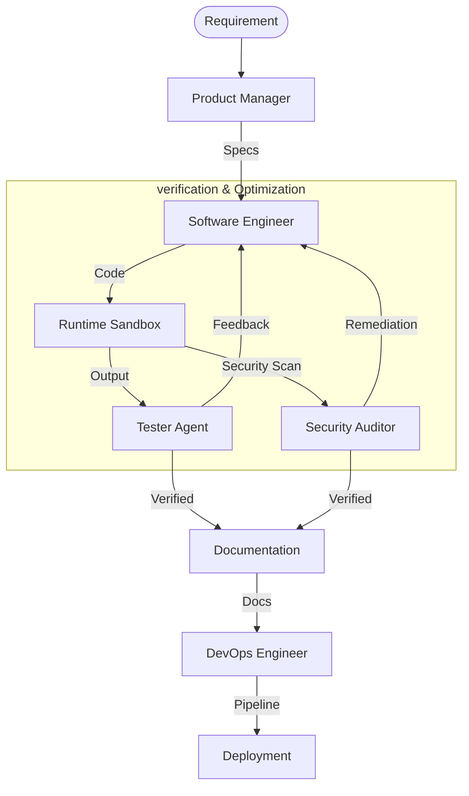

# Synapticity: Technical Framework Overview (v3.0)

## Executive Summary

Synapticity is an autonomous software development lifecycle (SDLC) framework designed to streamline the transition from high-level requirements to verified, production-ready software. By coordinating a team of specialized AI agents, the framework automates the most labor-intensive stages of development, including architectural planning, code implementation, security auditing, and deployment orchestration.

### The "Smart Factory" Model
Synapticity operates like an autonomous manufacturing facility:
- **Core Reasoning**: The underlying intelligence (Large Language Models).
- **Service Providers**: Specific model backends like Gemini or Ollama.
- **Specialized Agents**: Roles such as Product Manager, Software Engineer, and QA Tester.
- **Engineering Playbooks**: Domain-specific standards (Security, Performance) injected into the workflow.
- **Mission Workspaces**: Isolated, audited production environments for each objective.

---

## Architecture & Workflow

Synapticity utilizes a structured state machine to ensure code quality and system integrity. The workflow is divided into discrete phases, each handled by a dedicated sub-system following SOLID and DRY engineering principles.

### Component Breakdown
The framework is built on a modular foundation, separating concerns across multiple logical layers:

- **Interface Layer**: A CLI-based command center for mission management.
- **Orchestration Layer**: The mission engine that coordinates transitions between development phases.
- **Intelligence Layer**: The agent runner that manages communication with LLM adapters.
- **Execution Layer**: A sandboxed runtime (Docker or Bare-Metal) for safe code verification.
- **Persistence Layer**: Specialized managers for state, logging, and workspace commits.
- **Utility Layer**: Helper systems for indexing projects and managing GitHub deployments.

---

## Design Philosophy

The codebase is engineered for scalability and maintainability, adhering to industry-standard design patterns:

- **Single Responsibility**: Every module (e.g., `MissionStateManager`, `AgentRunner`) has one defined job.
- **Open-Closed Principle**: The platform is extensible; new commands or agents can be added by registering them in the core registry without modifying existing logic.
- **Dependency Inversion**: High-level logic depends on abstract interfaces, allowing for seamless transitions between different model providers.
- **Continuous Learning**: A reflection engine analyzes mission logs post-completion to synthesize and persist "lessons learned," improving future reliability.

---

## The Specialist Agent Pool

To prevent performance degradation often seen in "generalist" models, Synapticity distributes tasks across distinct personas:

- **Product Manager**: Focuses on requirement analysis and architectural design.
- **Software Engineer**: Specializes in synthesizing performant, idiomatic code.
- **Tester Agent**: Validates logic and identifies structural issues.
- **Security Auditor**: Conducts static analysis to identify potential vulnerabilities.
- **Technical Writer**: Ensures that the final hand-off includes comprehensive documentation.
- **DevOps**: Automates the creation of CI/CD pipelines.

---

## Security & Reliability

Execution safety is a core requirement of the framework.

- **Sandboxed Environments**: AI-generated code is executed in an isolated runtime to prevent unintended host interactions.
- **Vulnerability Scanning**: Automated static analysis tools (e.g., Bandit) are integrated directly into the verification loop.
- **Automatic Remediation**: The framework includes self-healing cycles where QA agents provide direct feedback to the engineer persona to resolve errors.

For more information, please see the [README.md](README.md), [architecture_map.md](architecture_map.md), and the active [Project Roadmap](tasks.txt).

---
