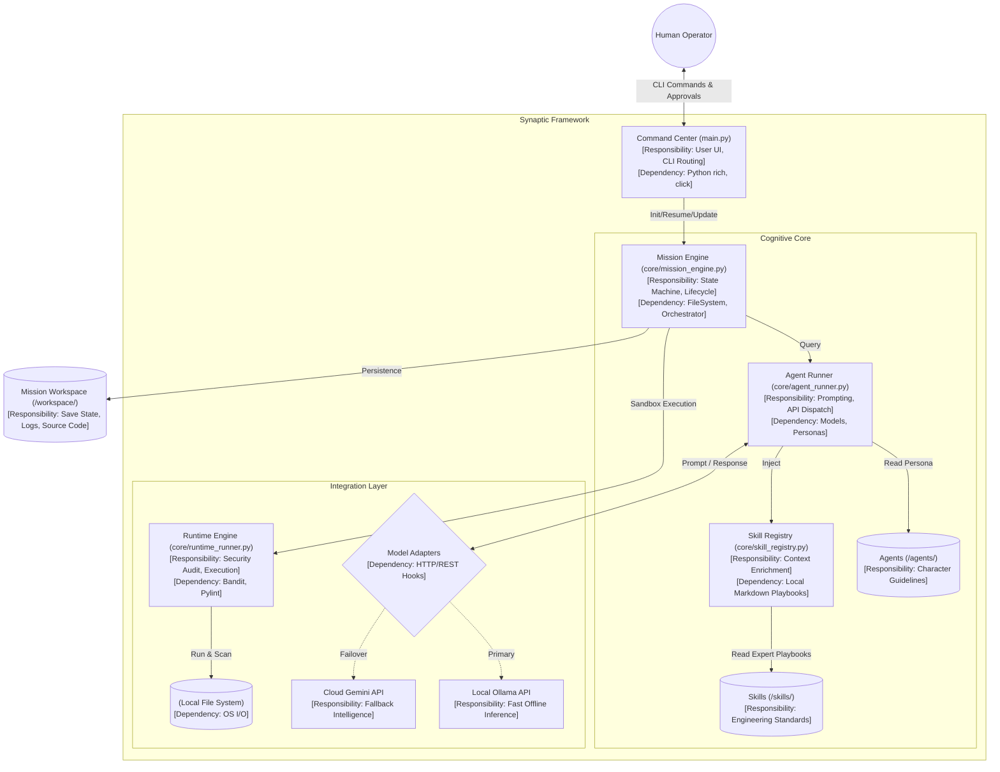
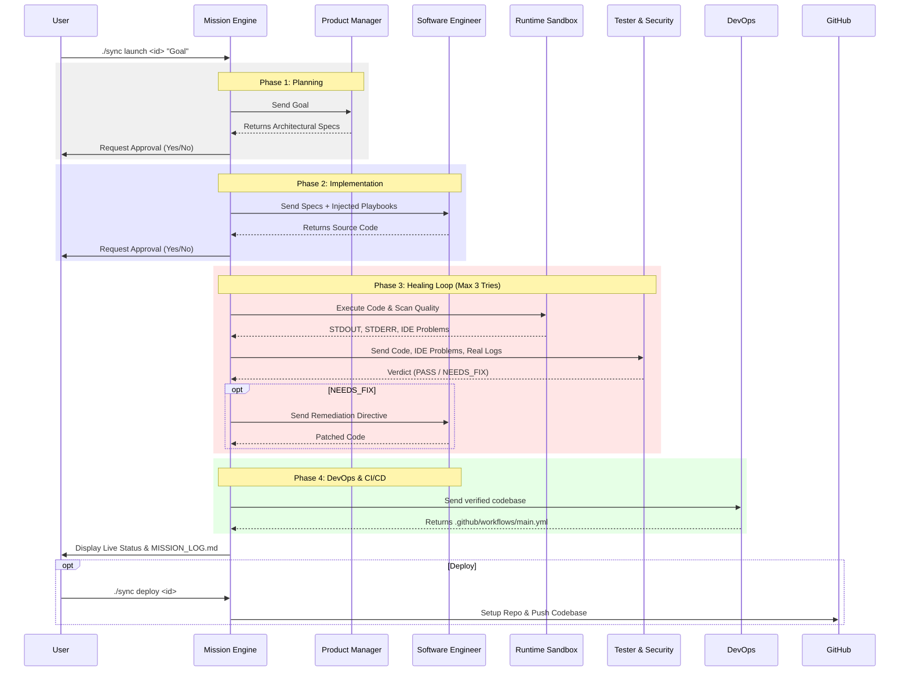

# Synapticity 3.0: Enterprise Architecture & Data Flow Map

This document serves as the comprehensive "Source of Truth" for the Synaptic Agentic Framework. It defines the system architecture, component responsibilities, data flow, and user interaction mechanics required for autonomous, principal-grade software engineering.

---

## [ARCH] 1. High-Level Component Architecture
The system follows a Hexagonal (Ports and Adapters) structure, strictly isolating the cognitive core (Agents) from the orchestration engine and the integration layer (Models & Runtimes).



---

## [UPDATE] 2. Data Flow & Mission Lifecycle
The core workflow is a State Machine (`synaptic.core.mission_engine.MissionEngine`). Data moves through a strict pipeline where each agent consumes the previous phase's output as its input.



### Real-Time Telemetry Flow (CLI Example)
During Phase 3 (Healing Loop), the Synaptic engine outputs real-time feedback mimicking an IDE workflow. This ensures the operator has full observability:

```text
INFO: MISSION START: mission-vault | Objective: Build a secure FastAPI encrypted vault.
[LAUNCH] synaptic Engaged | Mission: mission-vault (Phase: COMPLETED)
[SEC] Verification Loop 1...
[TEST] Running code in sandbox...
<rich.panel.Panel displays Sandbox STDOUT/STDERR>
[SCAN] Scanning for structural 'Problems' (IDE Simulation)...
[*] TESTER is working: Verifying Functional & Structural Integrity (via Ollama)...
```

---

## [USER] 3. User Activity & Mechanics
The human operator is an integral control mechanism ("Human-in-the-loop").

- **Mission Management**: Users interact via `main.py` using CLI actions (`launch`, `resume`, `update`, `dash`, `remove`, `agent`, `audit`).
- **Interactive Telemetry**: During agent execution, users see real-time logging detailing the task (e.g., `[AI] SWE is working: Synthesizing Source Code...`).
- **The "Update" Mechanic**: If a user realizes requirements missed the mark, or wants to pivot, they execute `update <mission_id> <new_goal>`. The system clears old plans and re-enters Phase 1 using the updated context.
- **Approving Gates**: At major milestones (Planning, Implementation), execution suspends. The user receives a `Mission Briefing` panel and must explicitly press `ENTER` to proceed or `q` to abort.

---

## [COMPONENT] 4. System Components: Inputs, Outputs, & Responsibilities

### A. The Agent Personas (`agents/`)
| Persona | Input Required | Output Produced | Responsibility |
| :--- | :--- | :--- | :--- |
| **Product Manager** | User Goal | `Architecture Specs` | Translates raw goals into strict AC, data models, and edge cases. |
| **Software Engineer** | `Specs` + `Skills` | `Source Code` | Writes idiomatic, SOLID-compliant code using expert playbooks. |
| **Tester** | `Specs` + `Code` + `Runtime Logs` + `IDE Problems` | `QA Verdict & Remediations` | Compares execution output against specs; rejects linting/logic flaws. |
| **Oncall Engineer** | `Code` + `Bandit Static Scan` | `Security Verdict` | Audits for prompt injections, secrets, or data privacy risks. |
| **Writer** | `Objective` + `Specs` + `Final Code` | `TECHNICAL_DOCS.md` | Generates final hand-off documentation for the workspace. |
| **DevOps Engineer** | `Objective` + `Code` | `.github/workflows/main.yml` | Synthesizes precise CI/CD pipelines mapped to the detected tech stack. |

### B. Core Engines (`synaptic/core/`)
| Component | Function | Data Handled |
| :--- | :--- | :--- |
| **MissionEngine** | State Coordinator | Manages `state.json` (Phase tracking, Mission History Logging). |
| **AgentRunner** | Execution Wrapper | Parses Markdown personas, injects Prompts, handles model failovers. |
| **SkillRegistry** | Semantic Injector | Scans prompts for keywords (e.g., "db", "security") and appends Markdown playbooks. |
| **RuntimeRunner** | Sandbox Emulator | Evaluates code in memory, captures `stdout/stderr`, runs `ruff/pylint` and `bandit`. |
| **ResourceFetcher** | Ingestion Adapter | Polymorphically downloads models or playbooks from github using `ingest <type>`. |
| **GitDeployer** | Deployment Engine | Autonomous GitHub connection via token, initializing `git` sub-runtimes. |

### C. Persistent Storage (`workspace/`)
Data is isolated strictly by `mission_id`. Inside each mission folder:
- `state.json`: Critical checkpointing data allowing pauses/resumes.
- `MISSION_LOG.md`: Auto-generated audit trail of agent "thoughts" and actions.
- `memory/transcript.jsonl`: Handled by `MemoryLogger`, a pristine log of all deep API transactions (inputs/outputs).
- `output/main.py`: The finalized, verified source code.
- `output/TECHNICAL_DOCS.md`: Architecture and usage instructions.
- `output/.github/workflows/main.yml`: Auto-generated deployment pipeline.

---

## [SEC] 5. Operational Resilience & Meta-Cognition Guardrails
- **Configurable Fallover Hierarchy**: Traffic is prioritized based on explicit `.env` config triggers (`OLLAMA_ACTIVE=True`, `GEMINI_ACTIVE=True`). If Ollama represents primary execution and fails, `AgentRunner` seamlessly escalates. If both are marked `False`, the system intentionally halts to prevent runaway billing algorithms.
- **Infinite Model Pluggability**: By using `AbstractModel`, integrating OpenAI or Claude into Synapticity costs <1 hr of Dev time and does not impact `AgentRunner` parsing sequences.
- **Self-Optimizing Meta-Cognition Contexts**: Central system attributes (heartbeat monitors, logging parameters) map into discrete environments, providing a future bedrock for a theoretical *Admin Agent* that could physically rewrite the `config.py` in production as it monitors framework cost. 
- **Zero-Defect Enforcement**: The `RuntimeRunner` acts as a simulated VSCode environment intercepting failed lint sweeps.
- **I/O Encoding Safety**: Explicit `utf-8` tracking prevents Windows cross-platform corruption.
