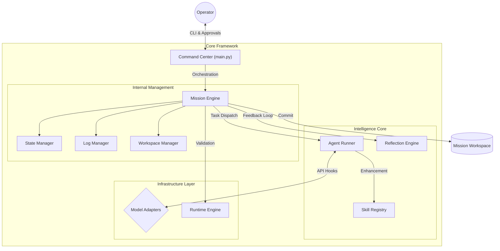
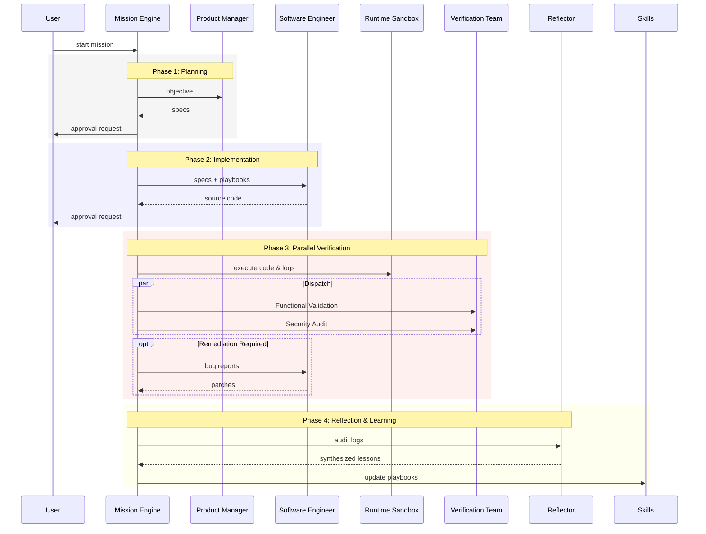

# Synapticity 3.0: Framework Architecture & Data Flow

This document provides a technical overview of the Synapticity framework. it defines the system's architecture, component responsibilities, and the data pipelines that enable autonomous software development.

---

## Conceptual Introduction
To understand Synapticity, visualize an **Autonomous Engineering Factory**. The framework orchestrates various "Specialist Stations" (Agents) that follow "Standard Operating Procedures" (Skills) to transform raw requirements into verified products.

### Core Concepts

| Concept | Description | Analogy |
| :--- | :--- | :--- |
| **LLM** | The underlying reasoning engine. | General Intelligence |
| **Model** | A specific instance of an LLM (e.g., Gemini, Ollama). | Service Provider |
| **Agent** | A specialized worker given a persona and tools. | Specialist Engineer |
| **Skill** | Domain-specific standards injected into an agent's context. | Expert Playbook |
| **Mission** | A scoped development task with its own workspace. | Production Run |

### Workflow Example
1. **Initiation**: A requirement is provided (e.g., "Build a secure API").
2. **Planning**: The **Product Manager** agent drafts architectural specifications.
3. **Implementation**: The **Software Engineer** agent writes code using **SOLID Skills**.
4. **Verification**: The **Tester** and **Security Auditor** agents validate the code in parallel.
5. **Reflection**: Post-mission, the **Reflector** agent analyzes logs to optimize future performance.

---

## High-Level Component Architecture
The system follows a modular structure, isolating core cognitive logic from orchestration and integration layers.

---

## Data Flow & Lifecycle
The development cycle is managed by a state machine that ensures each phase is verified before proceeding.

---

## System Components

### Agent Personas
| Persona | Responsibility |
| :--- | :--- |
| **Product Manager** | Translates goals into technical specifications and data models. |
| **Software Engineer** | Writes clean, modular code following the provided specs. |
| **Tester** | Validates code execution and identifies structural defects. |
| **Security Auditor** | Conducts static analysis to ensure data privacy and security. |
| **Technical Writer** | Documents the final output for the workspace. |
| **DevOps** | Configures automation pipelines and deployment workflows. |

### Core Modules
- **MissionEngine**: Orchestrates the state transitions and delegates tasks to sub-systems.
- **AgentRunner**: Manages prompting, persona loading, and handles model fallback logic.
- **SkillRegistry**: Injects domain-specific engineering standards based on the current task.
- **RuntimeRunner**: Executes code in an isolated sandbox to capture logs and identifies errors.
- **ReflectionEngine**: Performs post-mortem analysis of missions to improve framework reliability.
- **MissionLogger**: Maintains the unified audit trail for both the operator and agents.

### Workspace Isolation
All mission data is stored strictly within specialized directories to prevent state leakage:
- `state.json`: Precise tracking of the mission checkpoint.
- `MISSION_LOG.md`: A readable history of every decision and action.
- `output/`: The final, verified source code and documentation.

---

## Operational Guardrails
- **Automated Fallback**: The framework prioritizes configured model backends (e.g., Ollama) and automatically escalates to fallback providers (e.g., Gemini) to ensure continuity.
- **Verification Enforcement**: No code is committed to the workspace until it passes the combined functional and security verification loop.
- **Encoding Safety**: Uses standardized UTF-8 tracking to ensure consistency across different operating systems.
