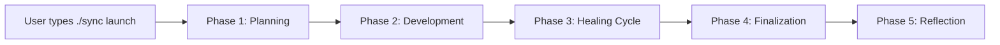
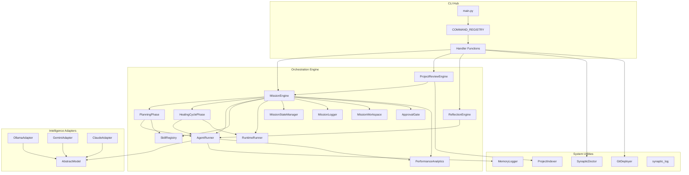
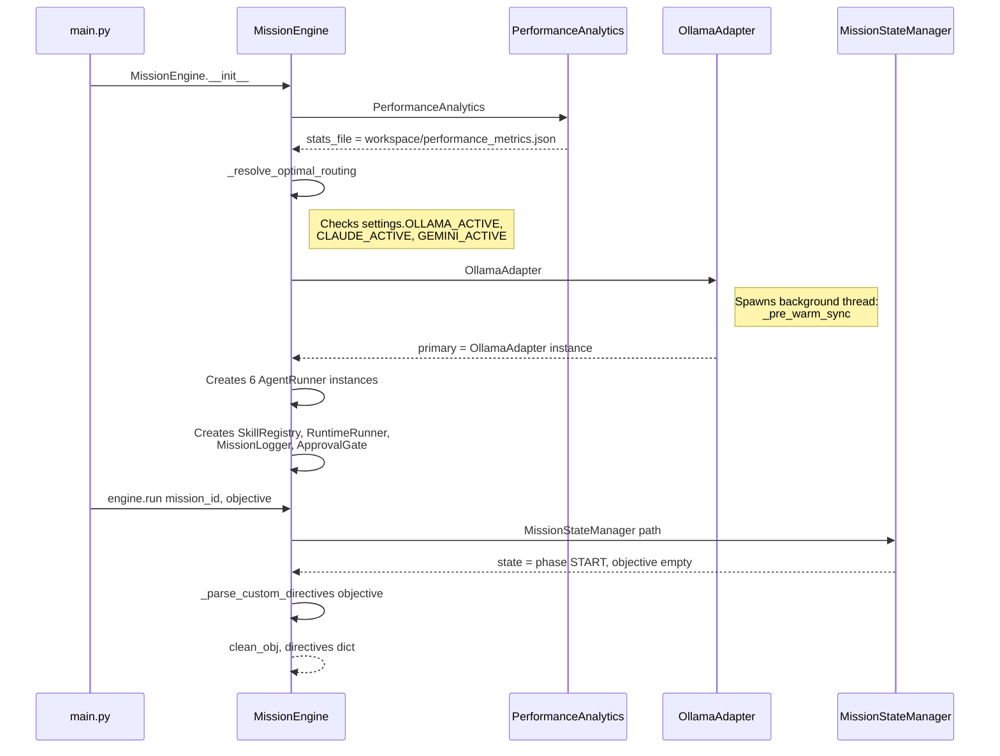
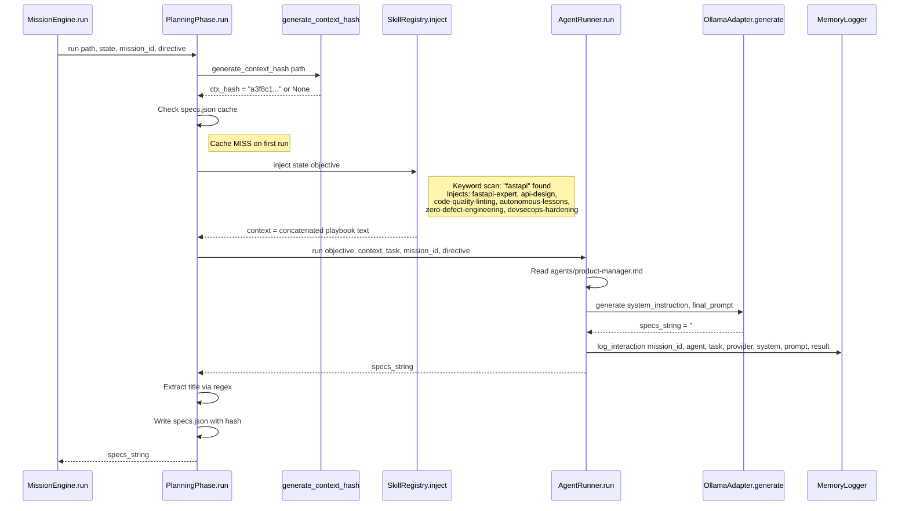
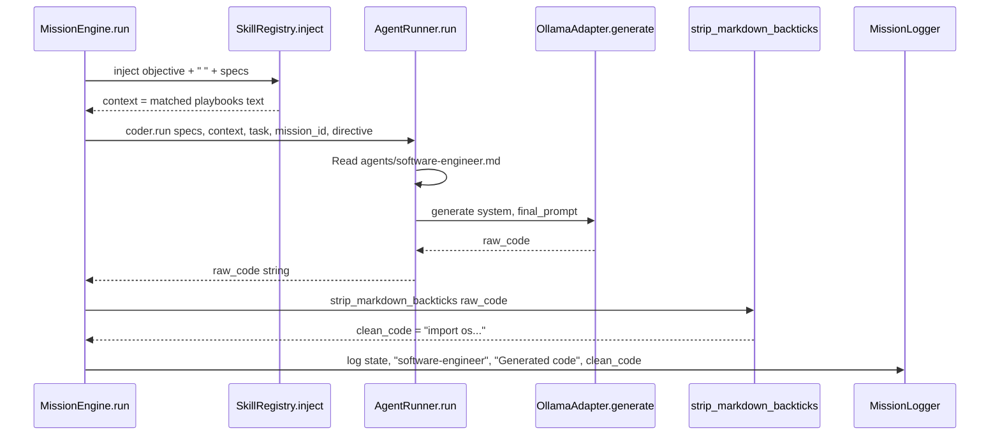
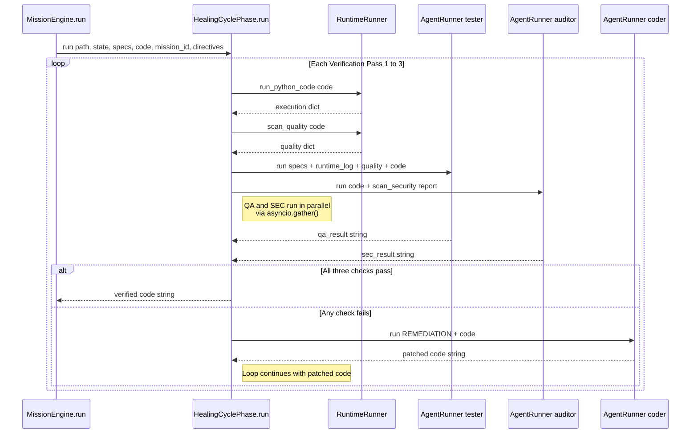
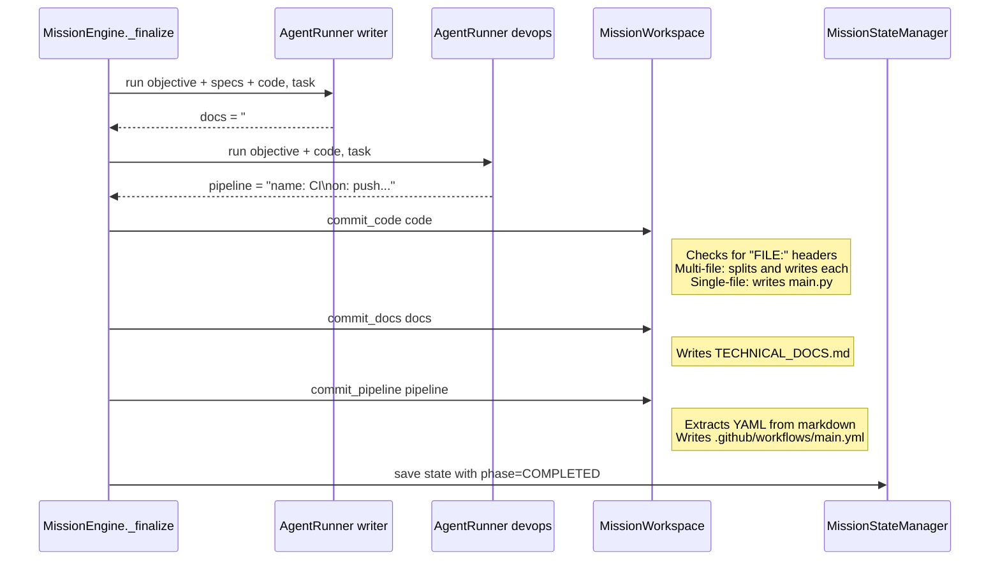
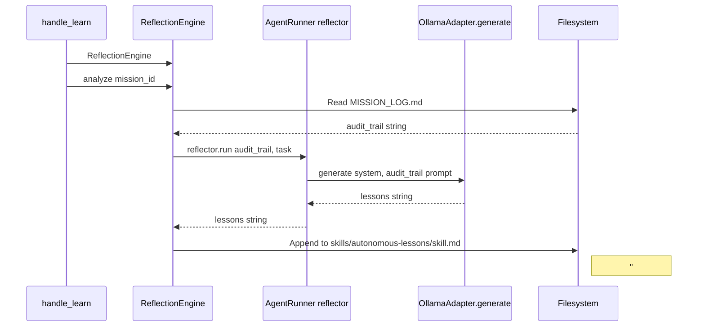
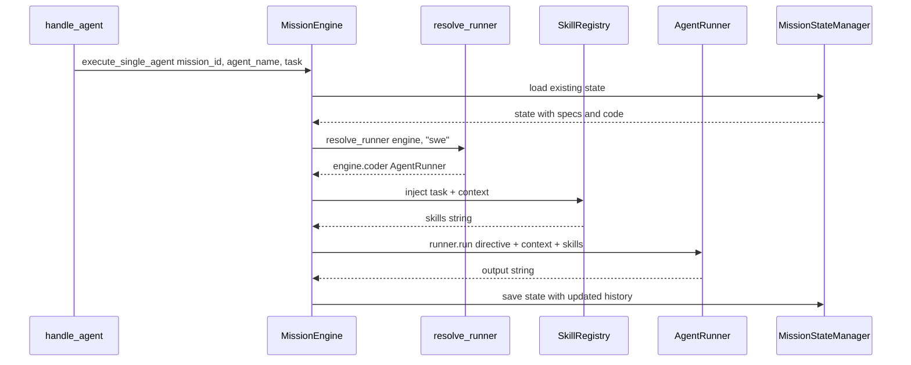
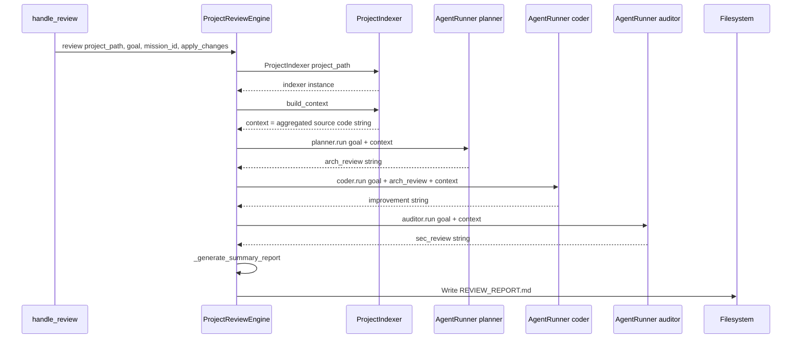

# Synapticity v3.3: The Complete Technical Guide

> Written for someone who is brand new to the AI ecosystem. This guide starts with the fundamentals of how AI works, then takes you through every single class and method in the Synapticity framework.

---

## Part 1: AI Fundamentals (For Beginners)

### What is a Large Language Model (LLM)?

An LLM is a computer program that has been trained on billions of sentences from books, websites, and code repositories. After this training, it can predict what text should come next given a prompt. When you type "Write a Python function that sorts a list," the model generates the code by predicting, one word at a time, the most likely response.

**Key takeaway**: An LLM does not "understand" code the way a human does. It is an extremely powerful pattern-matching engine trained on human knowledge.

### How Do You Talk to an LLM? (API Calls)

You communicate with an LLM by sending it two pieces of text over the internet:

1. **System Instruction**: A hidden instruction that tells the AI *who it is*. For example: "You are a senior Python engineer. Write production-quality code."
2. **User Prompt**: The actual task you want done. For example: "Build a FastAPI JWT authentication router."

The AI processes both and returns a **response string** — usually code, text, or structured data.

### What is an "Agent"?

An agent is an LLM wrapped with extra logic. Instead of just sending one prompt and getting one answer, an agent can:

- **Use tools** (run code, search the web, read files)
- **Follow a workflow** (plan first, then code, then test)
- **Remember context** (keep track of what happened before)
- **Make decisions** (if the test fails, fix the code and try again)

Synapticity is a **multi-agent system** — it runs a team of specialized agents (Product Manager, Software Engineer, QA Tester, etc.) that collaborate on a project.

### What is a "Model Adapter"?

Different companies offer different LLMs:

| Provider            | Model Examples       | Access Method                 |
| :------------------ | :------------------- | :---------------------------- |
| **Google**    | Gemini 2.0 Flash     | Cloud API (internet required) |
| **Anthropic** | Claude 3.5 Sonnet    | Cloud API (internet required) |
| **Ollama**    | Gemma 4, Qwen, Llama | Local (runs on YOUR computer) |

A **Model Adapter** is a Python class that knows how to talk to one specific provider. Synapticity has three adapters so it can seamlessly switch between local and cloud models.

### What is "Context"?

LLMs have a limited "memory window" called the **context window** (measured in tokens, roughly 1 token = 3/4 of a word). Everything the AI needs to know — the system instruction, the user's goal, code files, test results — must fit inside this window.

Synapticity carefully manages what goes into the context to maximize the quality of AI responses.

### What is a "Prompt"?

A prompt is any text you send to the AI. In Synapticity, prompts are constructed automatically by combining:

- The agent's persona (from a `.md` file)
- Relevant engineering playbooks (from the `skills/` folder)
- The user's objective and any previous code/test results

### What is "Fine-Tuning"?

Fine-tuning is the process of taking a pre-trained LLM and teaching it new skills by showing it examples of correct behavior. Synapticity's roadmap includes offline fine-tuning using a tool called **Unsloth** to improve local models based on past mission successes and failures.

---

## Part 2: How Synapticity Works (The Big Picture)

Synapticity is a **command-line software factory**. You give it a goal (like "Build a REST API"), and it autonomously:

1. **Plans** the architecture (Product Manager agent)
2. **Writes** the source code (Software Engineer agent)
3. **Tests** the code in a sandbox (QA + Security agents)
4. **Fixes** any bugs automatically (Healing Cycle)
5. **Documents** everything (Technical Writer agent)
6. **Deploys** to GitHub (DevOps agent)
7. **Learns** from the experience (Reflection Engine)

### The Mission Lifecycle



---

## Part 3: Complete Class & Method Reference

### Directory Structure

```
Synapticity/
  main.py                          # CLI entry point (33 lines)
  sync.bat                         # Windows shortcut: python main.py %*
  synaptic/
    __init__.py                    # Package API: launch(), resume(), dispatch(), learn()
    config.py                      # Settings class (Pydantic)
    cli/
      registry.py                  # COMMAND_REGISTRY dict
      ui.py                        # Dashboard and help renderers
      utils.py                     # Shared CLI helpers
      handlers/
        mission.py                 # launch, resume, update, remove, agent
        observe.py                 # audit, log
        integration.py             # deploy, ingest, stress, admin
        review.py                  # review
        learning.py                # learn
        stats.py                   # stats
    core/
      mission_engine.py            # MissionEngine orchestrator
      mission_phases.py            # PlanningPhase, HealingCyclePhase
      mission_state.py             # MissionStateManager (state.json I/O)
      mission_logger.py            # MissionLogger (MISSION_LOG.md)
      mission_workspace.py         # MissionWorkspace (output/ writes)
      mission_gate.py              # ApprovalGate (HITL prompts)
      agent_runner.py              # AgentRunner (LLM dispatch)
      agent_dispatcher.py          # resolve_runner() alias map
      skill_registry.py            # SkillRegistry (playbook injection)
      runtime_runner.py            # RuntimeRunner (sandbox execution)
      analytics.py                 # PerformanceAnalytics (scorecards)
      project_review_engine.py     # ProjectReviewEngine (external audits)
      self_learning.py             # ReflectionEngine (lesson synthesis)
    models/
      base.py                      # AbstractModel (ABC interface)
      ollama.py                    # OllamaAdapter (local inference)
      gemini.py                    # GeminiAdapter (Google cloud)
      claude.py                    # ClaudeAdapter (Anthropic cloud)
    utils/
      exceptions.py                # Custom exception hierarchy
      formatting.py                # strip_markdown_backticks()
      hashing.py                   # generate_context_hash()
      logger.py                    # synaptic_log (Python logging)
      memory_logger.py             # MemoryLogger (JSONL transcripts)
      doctor.py                    # SynapticDoctor (diagnostics)
      git_deployer.py              # GitDeployer (GitHub push)
      project_indexer.py           # ProjectIndexer (filesystem crawler)
      resource_fetcher.py          # RemoteResourceFetcher, SkillIngestor, AgentIngestor
  agents/                          # Agent persona markdown files
  skills/                          # Engineering playbook folders (29 domains)
  workspace/                       # Per-mission isolated state storage
```

---

### 3.1 Entry Point: `main.py`

**Purpose**: The CLI gateway. Parses `sys.argv`, looks up the command in `COMMAND_REGISTRY`, and calls the handler.

| Method     | Signature      | What It Does                                                                                                                              |
| :--------- | :------------- | :---------------------------------------------------------------------------------------------------------------------------------------- |
| `main()` | `() -> None` | Reads `sys.argv[1]` as the action, looks it up in `COMMAND_REGISTRY`, and calls the matched handler function. If no args, shows help. |

**Dependencies**: `COMMAND_REGISTRY` from `synaptic.cli`, `show_help` from `synaptic.cli.ui`, `SynapticError` from `synaptic.utils.exceptions`.

**Error Boundary**: Catches `SynapticError`, `KeyboardInterrupt`, and generic `Exception` at the top level, prints a clean error, and exits.

---

### 3.2 Package API: `synaptic/__init__.py`

**Purpose**: Provides a clean Python API for programmatic use (without the CLI).

| Function       | Signature                                         | What It Does                                                          |
| :------------- | :------------------------------------------------ | :-------------------------------------------------------------------- |
| `launch()`   | `(mission_id: str, objective: str)`             | Creates a `MissionEngine` and runs `asyncio.run(engine.run(...))` |
| `resume()`   | `(mission_id: str)`                             | Same as launch but without an objective (continues from saved state)  |
| `dispatch()` | `(mission_id: str, agent_name: str, task: str)` | Sends a single agent to do an isolated task                           |
| `learn()`    | `(mission_id: str)`                             | Creates a `ReflectionEngine` and analyzes the mission logs          |

**Note**: The system version is currently **3.3.0**, synchronized across the engine, CLI, and documentation.

---

### 3.3 Configuration: `synaptic/config.py`

**Purpose**: Single source of truth for all environment settings. Uses Pydantic `BaseSettings` to merge `.env` file values with defaults.

**Class: `Settings(BaseSettings)`**

| Setting                | Type  | Default                                   | Purpose                       |
| :--------------------- | :---- | :---------------------------------------- | :---------------------------- |
| `VERSION`            | str   | `"3.3.0"`                               | Framework version             |
| `GEMINI_ACTIVE`      | bool  | `False`                                 | Enable/disable Gemini cloud   |
| `GEMINI_MODEL`       | str   | `"gemini-2.0-flash"`                    | Cloud model name              |
| `SLEEP_BUFFER`       | float | `4.0`                                   | Seconds between Gemini calls  |
| `OLLAMA_ACTIVE`      | bool  | `True`                                  | Enable/disable local Ollama   |
| `OLLAMA_URL`         | str   | `"http://localhost:11434/api/generate"` | Ollama API endpoint           |
| `OLLAMA_MODEL`       | str   | `"gemma4:latest"`                       | Local model name              |
| `CLAUDE_ACTIVE`      | bool  | `False`                                 | Enable/disable Claude         |
| `CLAUDE_MODEL`       | str   | `"claude-3-5-sonnet-20240620"`          | Claude model name             |
| `AGENT_PATH`         | str   | `"agents"`                              | Directory for persona files   |
| `SKILL_PATH`         | str   | `"skills"`                              | Directory for playbooks       |
| `WORKSPACE_PATH`     | str   | `"workspace"`                           | Directory for mission data    |
| `MAX_RETRY_ATTEMPTS` | int   | `3`                                     | Healing cycle max loops       |
| `INTERACTIVE_MODE`   | bool  | `True`                                  | Enable HITL approval gates    |
| `HEARTBEAT_INTERVAL` | int   | `30`                                    | CLI progress update frequency |
| `ENABLE_HOT_RELOAD`  | bool  | `True`                                  | Live skill file watching      |
| `USE_DOCKER_SANDBOX` | bool  | `False`                                 | Route execution to Docker     |
| `ADMIN_PASSCODE`     | str   | `"alpha-tango-77"`                      | CLI admin gate password       |

**Computed Properties:**

| Property              | Returns       | Logic                                                                              |
| :-------------------- | :------------ | :--------------------------------------------------------------------------------- |
| `GEMINI_KEYS`       | `List[str]` | Scans env for `GEMINI_KEY_1` through `GEMINI_KEY_10`, filters out placeholders |
| `ANTHROPIC_API_KEY` | `str`       | Reads `ANTHROPIC_API_KEY` from environment                                       |
| `IS_HEALTHY`        | `bool`      | `True` if at least one engine (Ollama, Gemini, or Claude) is configured          |

**Singleton**: `settings = Settings()` is instantiated at module level and imported everywhere.

---

### 3.4 Intelligence Layer: `synaptic/models/`

#### 3.4.1 `AbstractModel` (base.py)

**Purpose**: Abstract Base Class (ABC) contract that all model adapters must follow.

| Method         | Signature                                         | Contract                                                                        |
| :------------- | :------------------------------------------------ | :------------------------------------------------------------------------------ |
| `generate()` | `(system_instruction: str, prompt: str) -> str` | Must accept a system instruction and user prompt, return the AI's text response |

All three adapters inherit from this. This is what enables **Dependency Inversion** — the rest of the system only knows about `AbstractModel`, not the specific provider.

#### 3.4.2 `OllamaAdapter` (ollama.py) — Local AI

**Purpose**: High-performance local inference via Ollama's REST API. Features auto-service startup, auto-model pull, and infinite VRAM residency.

| Method                          | Signature                                     | What It Does                                                                                          |
| :------------------------------ | :-------------------------------------------- | :---------------------------------------------------------------------------------------------------- |
| `__init__()`                  | `()`                                        | Sets URL/model from config. Spawns a background thread for `_pre_warm_sync()`                       |
| `_pre_warm_sync()`            | `()`                                        | Ensures Ollama service is running, model exists, and sends a warm-up request with `keep_alive: -1`  |
| `_ensure_service_sync()`      | `()`                                        | Checks if Ollama is reachable. If not, calls `_start_service_cli()`                                 |
| `_ensure_model_exists_sync()` | `()`                                        | Checks `/api/tags` for the model. If missing, triggers an automatic `pull`                        |
| `_start_service_cli()`        | `()`                                        | Platform-aware service bootstrapper (tries `ollama serve` on multiple paths)                        |
| `generate()`                  | `async (system_instruction, prompt) -> str` | Builds the JSON payload with `temperature: 0.1`, `num_ctx: 8192`, calls `_make_request_async()` |
| `_make_request_async()`       | `async (payload, is_retry) -> str`          | Uses `httpx.AsyncClient` to POST to Ollama. Retries once on empty response or connection error      |

**Key Design**: `keep_alive: -1` tells Ollama to never unload the model from VRAM, eliminating cold-start latency.

#### 3.4.3 `GeminiAdapter` (gemini.py) — Google Cloud

**Purpose**: Cloud-based inference with automated multi-key rotation and 429 rate-limit back-off.

| Method              | Signature                                     | What It Does                                                                                              |
| :------------------ | :-------------------------------------------- | :-------------------------------------------------------------------------------------------------------- |
| `__init__()`      | `()`                                        | Loads the key pool from `settings.GEMINI_KEYS`, restores the last-used key index from `tracker.json`  |
| `_load_session()` | `() -> int`                                 | Reads `tracker.json` to find which key index was used last                                              |
| `_init_client()`  | `() -> genai.Client`                        | Creates a `google.genai.Client` with the current key                                                    |
| `rotate()`        | `()`                                        | Advances to the next key in the pool, updates `tracker.json`, re-creates the client                     |
| `generate()`      | `async (system_instruction, prompt) -> str` | Calls `client.aio.models.generate_content()`. On 429/RESOURCE_EXHAUSTED, calls `rotate()` and retries |

**Key Design**: The `while True` loop in `generate()` means it will keep rotating keys until one works.

#### 3.4.4 `ClaudeAdapter` (claude.py) — Anthropic Cloud

**Purpose**: High-precision reasoning driver via Anthropic's Messages API.

| Method         | Signature                                     | What It Does                                                                                                                              |
| :------------- | :-------------------------------------------- | :---------------------------------------------------------------------------------------------------------------------------------------- |
| `__init__()` | `()`                                        | Sets `api_key`, `model`, and the Anthropic API URL                                                                                    |
| `generate()` | `async (system_instruction, prompt) -> str` | Builds headers with `x-api-key` and `anthropic-version`, POSTs a JSON payload via `httpx.AsyncClient`, extracts `content[0].text` |

---

### 3.5 Core Engine: `synaptic/core/`

#### 3.5.1 `MissionEngine` (mission_engine.py) — The Orchestrator

**Purpose**: The central controller. Coordinates all agents, phases, and sub-systems across the entire mission lifecycle.

| Method                         | Signature                                                         | What It Does                                                                                                                                                                                                                         |
| :----------------------------- | :---------------------------------------------------------------- | :----------------------------------------------------------------------------------------------------------------------------------------------------------------------------------------------------------------------------------- |
| `__init__()`                 | `()`                                                            | Creates `PerformanceAnalytics`, resolves model routing, instantiates 6 `AgentRunner` instances (planner, coder, tester, auditor, writer, devops), plus `SkillRegistry`, `RuntimeRunner`, `MissionLogger`, `ApprovalGate` |
| `run()`                      | `async (mission_id, objective) -> None`                         | The main lifecycle: loads state, parses directives, runs all 5 phases in sequence                                                                                                                                                    |
| `execute_single_agent()`     | `async (mission_id, agent_name, task) -> str`                   | Dispatches one agent for a targeted task within an existing mission                                                                                                                                                                  |
| `_parse_custom_directives()` | `(objective) -> tuple[str, dict]`                               | Extracts `[ROLE: instruction]` tags from the objective string (e.g. `[SWE: use FastAPI]`)                                                                                                                                        |
| `_resolve_optimal_routing()` | `() -> tuple`                                                   | Determines primary/fallback model pair. Checks `PerformanceAnalytics` for reliability and rotates to fallback if primary drop below 40%                                                                                            |
| `_log_mission_performance()` | `(mission_id, state, duration, success)`                        | Records mission outcome in analytics                                                                                                                                                                                                 |
| `_finalize()`                | `async (path, state, mission_id, workspace, state_mgr) -> None` | Runs Writer and DevOps agents, commits code/docs/pipeline to workspace, marks state as COMPLETED                                                                                                                                     |

**Agent Team Created in `__init__`:**

| Agent            | Persona File             | Role                         |
| :--------------- | :----------------------- | :--------------------------- |
| `self.planner` | `product-manager.md`   | Architectural specifications |
| `self.coder`   | `software-engineer.md` | Source code synthesis        |
| `self.tester`  | `tester.md`            | Functional verification      |
| `self.auditor` | `oncall-engineer.md`   | Security auditing            |
| `self.writer`  | `writer.md`            | Documentation generation     |
| `self.devops`  | `devops-engineer.md`   | CI/CD pipeline synthesis     |

#### 3.5.2 `AgentRunner` (agent_runner.py) — The AI Dispatcher

**Purpose**: Manages communication with a single AI persona. Handles prompt construction, model dispatch, progress monitoring, fallback, and logging.

| Method                          | Signature                                                                                   | What It Does                                                                                                                                                                               |
| :------------------------------ | :------------------------------------------------------------------------------------------ | :----------------------------------------------------------------------------------------------------------------------------------------------------------------------------------------- |
| `__init__()`                  | `(model, persona_file, fallback_model=None)`                                              | Stores the primary model, persona filename, and optional fallback                                                                                                                          |
| `run()`                       | `async (prompt, context, task, mission_id, directive) -> str`                             | Reads persona `.md` file, appends custom directive if present, builds the full prompt, calls `_dispatch_with_monitoring()`. On `ModelProviderError`, retries with `fallback_model` |
| `_dispatch_with_monitoring()` | `async (model_adapter, system, prompt, task, agent_name, mission_id, is_fallback) -> str` | Starts a heartbeat thread, calls `model_adapter.generate()`, logs via `MemoryLogger` and `PerformanceAnalytics`, returns the result                                                  |
| `_run_progress_monitor()`     | `(stop_event, agent_name, task, suffix)`                                                  | Background thread that prints "still working" messages every `HEARTBEAT_INTERVAL` seconds                                                                                                |
| `_get_model_identity()`       | `(adapter) -> str`                                                                        | Returns the human-readable model name from an adapter instance                                                                                                                             |

**Dependency Chain**: `AgentRunner` -> `AbstractModel.generate()` -> (Ollama/Gemini/Claude) -> AI Response

#### 3.5.3 `PlanningPhase` (mission_phases.py) — Phase 1

**Purpose**: Translates the user's objective into architectural specifications via the Product Manager agent.

| Method         | Signature                                                     | What It Does                                                                                                                                                                             |
| :------------- | :------------------------------------------------------------ | :--------------------------------------------------------------------------------------------------------------------------------------------------------------------------------------- |
| `__init__()` | `(planner, skill_registry, logger)`                         | Stores references to the PM agent, skill registry, and logger                                                                                                                            |
| `run()`      | `async (mission_path, state, mission_id, directive) -> str` | Checks `specs.json` cache via `generate_context_hash()`. On cache miss, calls `planner.run()` with the objective, extracts a title, saves specs to cache, returns the specs string |

**Caching**: Uses MD5 hashing of workspace files. If the hash matches `specs.json`, skips the LLM call entirely.

#### 3.5.4 `HealingCyclePhase` (mission_phases.py) — Phase 3

**Purpose**: The automated verification and repair loop. Runs code in a sandbox, dispatches QA and Security agents in parallel, and auto-remediates failures.

| Method              | Signature                                                                                  | What It Does                                                                                                                                                                                      |
| :------------------ | :----------------------------------------------------------------------------------------- | :------------------------------------------------------------------------------------------------------------------------------------------------------------------------------------------------ |
| `__init__()`      | `(coder, tester, auditor, runtime, logger)`                                              | Stores references to SWE, QA, Security agents plus RuntimeRunner and logger                                                                                                                       |
| `run()`           | `async (mission_path, state, specs, code, mission_id, directives) -> str`                | Loops up to `MAX_RETRY_ATTEMPTS`. Each iteration: sandbox execution, quality scan, parallel QA+Security dispatch via `asyncio.gather()`, verdict check, and if FAIL, sends remediation to SWE |
| `_run_sandbox()`  | `(code) -> dict`                                                                         | Calls `RuntimeRunner.run_python_code()`, displays results in a Rich panel                                                                                                                       |
| `_run_qa()`       | `async (specs, runtime_log, quality, code, mission_id, loop_i, state, directive) -> str` | Sends specs + runtime logs + quality problems to the QA agent                                                                                                                                     |
| `_run_security()` | `async (code, mission_id, loop_i, state, directive) -> str`                              | Runs `RuntimeRunner.scan_security()` (Bandit), then sends the scan report to the Security agent                                                                                                 |

**Verdict Logic**: Code is PASSED only when ALL THREE conditions are met:

1. `"VERDICT: SECURE"` in security result
2. `"VERDICT: PASS"` in QA result
3. `quality["clean"]` is `True` (no lint errors)

#### 3.5.5 `MissionStateManager` (mission_state.py) — State I/O

**Purpose**: Owns all `state.json` disk reads and writes.

| Method         | Signature                 | What It Does                                                                              |
| :------------- | :------------------------ | :---------------------------------------------------------------------------------------- |
| `__init__()` | `(mission_path)`        | Constructs the path to `mission_state.json`                                             |
| `load()`     | `() -> dict`            | Reads and returns the JSON state. On corruption, re-initializes to `{"phase": "START"}` |
| `save()`     | `(state: dict) -> None` | Writes the state dict to disk as JSON                                                     |

#### 3.5.6 `MissionLogger` (mission_logger.py) — Audit Trail

**Purpose**: Maintains the in-memory event history and writes `MISSION_LOG.md`.

| Method        | Signature                                   | What It Does                                                                                     |
| :------------ | :------------------------------------------ | :----------------------------------------------------------------------------------------------- |
| `log()`     | `(state, role, thought, content) -> None` | Appends a timestamped entry to `state["history"]` list                                         |
| `persist()` | `(mission_path, state) -> None`           | Writes the full history to a formatted `MISSION_LOG.md` with truncated content (1000 char cap) |

#### 3.5.7 `MissionWorkspace` (mission_workspace.py) — Output Writer

**Purpose**: Handles all filesystem writes to the `output/` directory.

| Method                | Signature                   | What It Does                                                                               |
| :-------------------- | :-------------------------- | :----------------------------------------------------------------------------------------- |
| `__init__()`        | `(mission_path)`          | Creates `output/` directory inside the mission folder                                    |
| `commit_code()`     | `(code: str) -> None`     | Supports multi-file splitting via `FILE: path` headers. Falls back to single `main.py` |
| `commit_docs()`     | `(docs: str) -> None`     | Writes `TECHNICAL_DOCS.md` to `output/`                                                |
| `commit_pipeline()` | `(raw_yaml: str) -> None` | Extracts YAML from markdown code blocks, writes to `output/.github/workflows/main.yml`   |

#### 3.5.8 `ApprovalGate` (mission_gate.py) — Human-in-the-Loop

**Purpose**: Pauses execution at key milestones and waits for operator approval.

| Method        | Signature                                   | What It Does                                                                               |
| :------------ | :------------------------------------------ | :----------------------------------------------------------------------------------------- |
| `request()` | `(milestone_name, current_phase) -> None` | If `INTERACTIVE_MODE` is True, displays a Rich panel and waits for Enter or 'q' to abort |

#### 3.5.9 `SkillRegistry` (skill_registry.py) — Knowledge Injection

**Purpose**: Discovers and injects relevant engineering playbooks into agent context based on keyword matching.

| Method                  | Signature                      | What It Does                                                                                                                                                                                                                                                                              |
| :---------------------- | :----------------------------- | :---------------------------------------------------------------------------------------------------------------------------------------------------------------------------------------------------------------------------------------------------------------------------------------- |
| `__init__()`          | `(path=settings.SKILL_PATH)` | Loads all `skill.md` files from skill subdirectories into an in-memory cache                                                                                                                                                                                                            |
| `inject()`            | `(target_str: str) -> str`   | Scans the target string for keywords, matches them against a trigger map (e.g. "fastapi" ->`fastapi-expert`), and concatenates the matching playbook content. Always injects `code-quality-linting`, `autonomous-lessons`, `zero-defect-engineering`, and `devsecops-hardening` |
| `_cache_skill()`      | `(folder, file_path)`        | Reads a skill file into RAM with its `mtime` for cache invalidation                                                                                                                                                                                                                     |
| `_check_hot_reload()` | `(folder, file_path)`        | Compares disk `mtime` vs cached `mtime`. Reloads if file was modified                                                                                                                                                                                                                 |

**29 Skill Domains**: agentic-architecture, agile-product-management, ai-security-safety, api-design, autonomous-lessons, clean-architecture, code-quality-linting, context-filter, cryptography-expert, data-privacy, devops-cicd, devsecops-hardening, domain-driven-design, edge-ai-local, fastapi-expert, llm-engineering, microservices, multi-agent-orchestration, nextjs-expert, pytest-modern, rag-implementation, security-scanner, shift-left-testing, solid-design-patterns, sqlalchemy-expert, technical-writing-standards, testing-strategies, typescript-clean, zero-defect-engineering.

#### 3.5.10 `RuntimeRunner` (runtime_runner.py) — Sandbox

**Purpose**: Safely executes generated Python code in isolated temp files and runs static analysis.

| Method                    | Signature               | What It Does                                                                                                                                                            |
| :------------------------ | :---------------------- | :---------------------------------------------------------------------------------------------------------------------------------------------------------------------- |
| `__init__()`            | `(timeout=10)`        | Sets execution timeout                                                                                                                                                  |
| `run_python_code()`     | `(code: str) -> dict` | Writes code to a temp `.py` file, executes via `subprocess.run()` (or Docker if `USE_DOCKER_SANDBOX`), returns `{success, stdout, stderr, exit_code, duration}` |
| `scan_security()`       | `(code: str) -> dict` | Runs Bandit SAST on the code, returns `{secure, issues, summary}`                                                                                                     |
| `scan_quality()`        | `(code: str) -> dict` | Runs `py_compile` for syntax check, then Ruff/Pylint for linting. Returns `{clean, problems, summary}`                                                              |
| `_create_temp_script()` | `(code: str)`         | Context manager that creates a temp file and auto-cleans it                                                                                                             |

#### 3.5.11 `PerformanceAnalytics` (analytics.py) — Scorecards

**Purpose**: Tracks agent reliability, mission success rates, and inference latency.

| Method                   | Signature                                           | What It Does                                                                    |
| :----------------------- | :-------------------------------------------------- | :------------------------------------------------------------------------------ |
| `__init__()`           | `()`                                              | Points to `workspace/performance_metrics.json`, initializes if missing        |
| `log_mission_result()` | `(mission_id, success, repairs, duration, model)` | Updates total missions, success rate, per-model metrics. Keeps last 100 entries |
| `log_inference()`      | `(model, duration)`                               | Records the duration of a single LLM call for latency tracking                  |
| `get_summary_report()` | `() -> str`                                       | Returns a formatted text report of all metrics                                  |

#### 3.5.12 `ProjectReviewEngine` (project_review_engine.py) — External Auditor

**Purpose**: Runs a 3-agent review pipeline on an external codebase (not a Synapticity mission).

| Method                         | Signature                                                        | What It Does                                                                                                                                                                                                 |
| :----------------------------- | :--------------------------------------------------------------- | :----------------------------------------------------------------------------------------------------------------------------------------------------------------------------------------------------------- |
| `__init__()`                 | `()`                                                           | Creates a `MissionEngine` and `MissionLogger`                                                                                                                                                            |
| `review()`                   | `async (project_path, goal, mission_id, apply_changes) -> str` | Indexes the project via `ProjectIndexer`, runs PM (architecture review), SWE (improvement proposals), Security (vulnerability assessment), compiles a report, optionally applies `FILE_PATCH` directives |
| `_generate_summary_report()` | `(path, goal, files, arch, improv, sec) -> str`                | Builds a markdown report from the three review passes                                                                                                                                                        |
| `_persist_review_artifact()` | `(mission_id, report) -> str`                                  | Saves `REVIEW_REPORT.md` to the workspace                                                                                                                                                                  |
| `_apply_patches()`           | `(project_path, improvement_output) -> None`                   | Parses `FILE_PATCH: path` blocks from SWE output and writes them to disk                                                                                                                                   |

#### 3.5.13 `ReflectionEngine` (self_learning.py) — Self-Learning

**Purpose**: Post-mission analysis that converts mission logs into persistent engineering lessons.

| Method         | Signature                     | What It Does                                                                                                                         |
| :------------- | :---------------------------- | :----------------------------------------------------------------------------------------------------------------------------------- |
| `__init__()` | `()`                        | Creates an `AgentRunner` with the `reflector.md` persona, using the best available model                                         |
| `analyze()`  | `async (mission_id) -> str` | Reads `MISSION_LOG.md`, sends it to the Reflector agent, appends the synthesized lessons to `skills/autonomous-lessons/skill.md` |

#### 3.5.14 `resolve_runner()` (agent_dispatcher.py) — Alias Resolver

**Purpose**: Maps fuzzy agent name strings to actual `AgentRunner` instances on the `MissionEngine`.

| Alias Keywords                      | Resolves To        |
| :---------------------------------- | :----------------- |
| `pm`, `product`                 | `engine.planner` |
| `swe`, `coder`, `software`    | `engine.coder`   |
| `test`, `qa`                    | `engine.tester`  |
| `oncall`, `security`, `audit` | `engine.auditor` |
| `writer`, `doc`                 | `engine.writer`  |
| `devops`, `deploy`, `ci`      | `engine.devops`  |

---

### 3.6 Utilities: `synaptic/utils/`

#### 3.6.1 Exception Hierarchy (exceptions.py)

```
SynapticError (base)
  +-- ConfigurationError      (bad env/settings)
  +-- ModelProviderError       (LLM API failure)
  +-- WorkflowError            (mission lifecycle failure)
  +-- SecurityAuditError       (security guardrail breach)
```

#### 3.6.2 `SynapticDoctor` (doctor.py) — Diagnostics

| Method                 | Signature                   | What It Does                                                                                               |
| :--------------------- | :-------------------------- | :--------------------------------------------------------------------------------------------------------- |
| `run_full_service()` | `@staticmethod`           | Checks vitals, auto-heals failures, re-checks vitals                                                       |
| `check_vitals()`     | `@staticmethod -> dict`   | Tests Gemini keys, Ollama connectivity, workspace directory, and agent personas. Returns a status registry |
| `heal()`             | `@staticmethod (results)` | Creates missing workspace, starts Ollama service, pulls missing models, prints Gemini guidance             |

#### 3.6.3 `GitDeployer` (git_deployer.py) — GitHub Deployment

| Method                    | Signature        | What It Does                                                                                                   |
| :------------------------ | :--------------- | :------------------------------------------------------------------------------------------------------------- |
| `__init__()`            | `(mission_id)` | Targets `workspace/<mission_id>/output/`                                                                     |
| `deploy()`              | `()`           | Runs `git init` -> `git add` -> `git commit` -> creates GitHub repo via REST API -> `git push --force` |
| `_create_remote_repo()` | `() -> str`    | Calls GitHub REST API v3. Checks if repo exists first, creates if not. Returns authenticated clone URL         |
| `_run_cmd()`            | `(cmd: list)`  | Subprocess wrapper that raises on non-zero exit                                                                |

#### 3.6.4 `ProjectIndexer` (project_indexer.py) — Filesystem Crawler

| Method              | Signature           | What It Does                                                                                                                                 |
| :------------------ | :------------------ | :------------------------------------------------------------------------------------------------------------------------------------------- |
| `__init__()`      | `(project_path)`  | Validates and stores the absolute path                                                                                                       |
| `build_context()` | `() -> str`       | Walks the directory tree, reads files matching `INDEXABLE_EXTENSIONS`, skips `SKIP_DIRS` and files > 50KB, returns one aggregated string |
| `list_files()`    | `() -> list[str]` | Returns relative paths of all indexable files                                                                                                |

#### 3.6.5 `RemoteResourceFetcher` (resource_fetcher.py) — Ingestion Framework

**Abstract Base Class** with two concrete subclasses:

| Class             | `_normalize_content()`                  | `_save_content()`                  |
| :---------------- | :---------------------------------------- | :----------------------------------- |
| `SkillIngestor` | Adds a playbook header, cleans whitespace | Writes to `skills/<name>/skill.md` |
| `AgentIngestor` | Adds a role ingestion header              | Writes to `agents/<name>.md`       |

Common `fetch()` method: converts GitHub URLs to raw, downloads content, normalizes, and saves.

#### 3.6.6 Other Utilities

| File                 | Function/Class                            | Purpose                                                                                               |
| :------------------- | :---------------------------------------- | :---------------------------------------------------------------------------------------------------- |
| `formatting.py`    | `strip_markdown_backticks(content)`     | Extracts raw code from AI-generated markdown code blocks                                              |
| `hashing.py`       | `generate_context_hash(workspace_path)` | MD5 hash of all `.md/.pdf/.txt` files in a workspace for spec caching                               |
| `logger.py`        | `get_logger(name) -> Logger`            | Creates a Python logger with file + console handlers. Global instance:`synaptic_log`                |
| `memory_logger.py` | `MemoryLogger.log_interaction(...)`     | Appends raw LLM transcript (system + prompt + response) to `workspace/<id>/memory/transcript.jsonl` |

---

### 3.7 CLI Layer: `synaptic/cli/`

#### Command Registry (`registry.py`)

The `COMMAND_REGISTRY` dict maps CLI action strings to handler functions:

| Command    | Handler                             | Source File                 |
| :--------- | :---------------------------------- | :-------------------------- |
| `dash`   | `show_dashboard`                  | `ui.py`                   |
| `help`   | `show_help`                       | `ui.py`                   |
| `stats`  | `handle_stats`                    | `handlers/stats.py`       |
| `doctor` | `SynapticDoctor.run_full_service` | `utils/doctor.py`         |
| `launch` | `handle_launch`                   | `handlers/mission.py`     |
| `resume` | `handle_resume`                   | `handlers/mission.py`     |
| `update` | `handle_update`                   | `handlers/mission.py`     |
| `remove` | `handle_remove`                   | `handlers/mission.py`     |
| `agent`  | `handle_agent`                    | `handlers/mission.py`     |
| `audit`  | `handle_audit`                    | `handlers/observe.py`     |
| `log`    | `handle_log`                      | `handlers/observe.py`     |
| `deploy` | `handle_deploy`                   | `handlers/integration.py` |
| `ingest` | `handle_ingest`                   | `handlers/integration.py` |
| `stress` | `handle_stress`                   | `handlers/integration.py` |
| `admin`  | `handle_admin`                    | `handlers/integration.py` |
| `review` | `handle_review`                   | `handlers/review.py`      |
| `learn`  | `handle_learn`                    | `handlers/learning.py`    |

#### CLI Utilities (`utils.py`)

| Function                          | Purpose                                                |
| :-------------------------------- | :----------------------------------------------------- |
| `sanitize_id(m_id)`             | Strips shell prefixes from mission IDs                 |
| `require_args(count, usage)`    | Validates `sys.argv` length, prints usage on failure |
| `load_state(mission_id)`        | Quick state.json reader for dashboard                  |
| `save_state(mission_id, state)` | Quick state.json writer for handlers                   |

---

### 3.8 Agent Personas: `agents/`

Each `.md` file is a system instruction that defines an agent's identity, constraints, and output format:

| File                     | Role               | Key Behavior                                                          |
| :----------------------- | :----------------- | :-------------------------------------------------------------------- |
| `orchestrator.md`      | Master coordinator | Plans multi-agent workflows                                           |
| `product-manager.md`   | PM                 | Translates goals into strict acceptance criteria and data models      |
| `software-engineer.md` | SWE                | Writes SOLID-compliant, idiomatic Python source code                  |
| `tester.md`            | QA                 | Verifies runtime outputs against specs, emits VERDICT: PASS/NEEDS_FIX |
| `oncall-engineer.md`   | Security           | Analyzes Bandit reports, emits VERDICT: SECURE/INSECURE               |
| `writer.md`            | Docs               | Generates TECHNICAL_DOCS.md markdown documentation                    |
| `devops-engineer.md`   | DevOps             | Synthesizes GitHub Actions YAML pipelines                             |
| `reflector.md`         | Meta-cognition     | Analyzes mission logs and synthesizes lessons learned                 |

---

## Part 4: Dependency Map



---

## Part 5: Data Flow Summary

| Phase           | Data In                 | Processor                         | Data Out         | Stored At                              |
| :-------------- | :---------------------- | :-------------------------------- | :--------------- | :------------------------------------- |
| 1. Planning     | User objective string   | `PlanningPhase` -> PM Agent     | `specs` string | `state.json`, `specs.json`         |
| 2. Development  | specs + skill playbooks | SWE Agent                         | Raw Python code  | `state.json`                         |
| 3. Healing      | Code source             | `RuntimeRunner` + QA + Security | Verified code    | `state.json`                         |
| 4. Finalization | Verified code + specs   | Writer + DevOps agents            | Docs + YAML      | `output/` directory                  |
| 5. Reflection   | `MISSION_LOG.md`      | Reflector Agent                   | Lessons string   | `skills/autonomous-lessons/skill.md` |

---

## Part 6: Full CLI Walkthrough (Input, Output & Behind the Scenes)

This section traces a complete mission from the moment you type a command until the code is deployed. Every terminal output line is shown, and every Python class that fires is explained.

---

### Step 1: Launch a Mission

**You type:**

```
./sync launch jwt-auth-api "Build a FastAPI JWT authentication router with login and protected endpoints"
```

**Terminal output:**

```
[START] Project jwt-auth-api (Phase: INITIAL)
[AI] Waking up Local Brain (Ollama)...
[SKILL] synaptic Skill Injected: code-quality-linting
[SKILL] synaptic Skill Injected: autonomous-lessons
[SKILL] synaptic Skill Injected: zero-defect-engineering
[SKILL] synaptic Skill Injected: devsecops-hardening
[SKILL] synaptic Skill Injected: api-design
[SKILL] synaptic Skill Injected: fastapi-expert
[PLAN] Planning the project structure...
```

**Behind the scenes:**

```
1. main.py reads sys.argv -> action = "launch"
2. COMMAND_REGISTRY["launch"] -> calls handle_launch()
3. handle_launch() calls synaptic.launch("jwt-auth-api", "Build a FastAPI...")
4. synaptic.launch() creates MissionEngine() and runs asyncio.run(engine.run(...))

   Inside MissionEngine.__init__():
     a. PerformanceAnalytics() loads workspace/performance_metrics.json
     b. _resolve_optimal_routing() checks which models are active:
        - settings.OLLAMA_ACTIVE = True -> OllamaAdapter() is created
        - OllamaAdapter.__init__() spawns a background thread
        - _pre_warm_sync() calls _ensure_service_sync()
        - Ollama is not running -> _start_service_cli() runs "ollama serve"
        - Terminal shows: [AI] Waking up Local Brain (Ollama)...
        - _ensure_model_exists_sync() checks /api/tags for the model
     c. primary = OllamaAdapter, fallback = GeminiAdapter (or None)
     d. 6x AgentRunner instances are created:
        - planner  = AgentRunner(ollama, "product-manager.md", fallback=gemini)
        - coder    = AgentRunner(ollama, "software-engineer.md", fallback=gemini)
        - tester   = AgentRunner(ollama, "tester.md", fallback=gemini)
        - auditor  = AgentRunner(ollama, "oncall-engineer.md", fallback=gemini)
        - writer   = AgentRunner(ollama, "writer.md", fallback=gemini)
        - devops   = AgentRunner(ollama, "devops-engineer.md", fallback=gemini)
     e. SkillRegistry() scans skills/ directory, caches 29 skill.md files into RAM
     f. RuntimeRunner(timeout=10) is created
     g. MissionLogger() and ApprovalGate() are created

   Inside MissionEngine.run("jwt-auth-api", "Build a FastAPI..."):
     a. Creates folder: workspace/jwt-auth-api/
     b. MissionStateManager("workspace/jwt-auth-api/") is created
     c. state_mgr.load() -> state.json does not exist -> returns {"phase": "START"}
     d. _parse_custom_directives() scans for [ROLE: ...] tags -> none found
     e. state["objective"] = "Build a FastAPI JWT authentication router..."

5. Phase 1 begins: state has no "specs" key yet
     a. PlanningPhase(planner, skills, log) is created
     b. generate_context_hash() hashes all .md/.txt files in workspace/jwt-auth-api/
     c. No specs.json cache exists -> cache miss
     d. SkillRegistry.inject() scans the objective string:
        - "fastapi" keyword -> triggers fastapi-expert
        - "api" keyword -> triggers api-design
        - Always injects: code-quality-linting, autonomous-lessons,
          zero-defect-engineering, devsecops-hardening
        - Terminal shows: [SKILL] synaptic Skill Injected: ...
     e. Terminal shows: [PLAN] Planning the project structure...
```

---

### Step 2: Planning Phase (AI Generates Specs)

**Terminal output:**

```
[10:15:22] PRODUCT-MANAGER started: Drafting Architectural Specs (via Ollama gemma4:latest)
  ... PRODUCT-MANAGER is still Drafting Architectural Specs (30s elapsed)
  ... PRODUCT-MANAGER is still Drafting Architectural Specs (60s elapsed)
[OK] PRODUCT-MANAGER: Drafting Architectural Specs finished (74.32s).

[SEC] Synaptic Mission Briefing
+----------------------------------------------+
| [OK] Design specs are ready for review       |
| Current Phase: PLANNED                       |
| Next Objective: Initiating subsequent cycle  |
+----------------------------------------------+

[LAUNCH] Press [ENTER] to authorize the next phase, or 'q' to abort:
```

**Behind the scenes:**

```
1. PlanningPhase.run() calls planner.run(objective, task="Drafting Architectural Specs")

   Inside AgentRunner.run():
     a. Reads file: agents/product-manager.md -> system instruction string
     b. No custom directive -> system stays unchanged
     c. final_prompt = "CONTEXT:\n<skills>\n\nTASK:\n<objective>"
     d. Calls _dispatch_with_monitoring(ollama, system, final_prompt, ...)

   Inside _dispatch_with_monitoring():
     a. Prints: [10:15:22] PRODUCT-MANAGER started: Drafting Architectural Specs...
     b. Spawns heartbeat thread -> prints "still working" every 30 seconds
     c. Calls OllamaAdapter.generate(system, final_prompt)

   Inside OllamaAdapter.generate():
     a. Builds JSON payload:
        model: "gemma4:latest"
        system: <product-manager.md content>
        prompt: <objective + skill playbooks>
        options: temperature 0.1, num_predict 2048, num_ctx 8192
        keep_alive: -1
     b. _make_request_async() POSTs to http://localhost:11434/api/generate
     c. Ollama processes for ~74 seconds
     d. Returns the specs string (markdown with file list, endpoints, models)

   Back in _dispatch_with_monitoring():
     a. Heartbeat thread is stopped via done_event.set()
     b. PerformanceAnalytics.log_inference("Ollama", 74.32)
     c. MemoryLogger.log_interaction() writes to workspace/jwt-auth-api/memory/transcript.jsonl
     d. Prints: [OK] PRODUCT-MANAGER: Drafting Architectural Specs finished (74.32s).

2. PlanningPhase.run() continues:
     a. Extracts title from specs via regex: "JWT Authentication Router API"
     b. state["title"] = "JWT Authentication Router API"
     c. MissionLogger.log(state, "product-manager", "Established Mission...", specs)
     d. Writes specs.json with MD5 hash for future cache hits
     e. Returns specs string

3. Back in MissionEngine.run():
     a. state["specs"] = <specs string>
     b. state["phase"] = "PLANNED"
     c. state_mgr.save(state) -> writes state.json to disk
     d. log.persist() -> writes MISSION_LOG.md
     e. ApprovalGate.request() -> shows the briefing panel (if INTERACTIVE_MODE)
     f. User presses ENTER to continue
```

---

### Step 3: Development Phase (AI Writes Code)

**Terminal output:**

```
[SKILL] synaptic Skill Injected: code-quality-linting
[SKILL] synaptic Skill Injected: fastapi-expert
[SKILL] synaptic Skill Injected: devsecops-hardening
[10:17:41] SOFTWARE-ENGINEER started: Synthesizing Source Code (via Ollama gemma4:latest)
  ... SOFTWARE-ENGINEER is still Synthesizing Source Code (30s elapsed)
[OK] SOFTWARE-ENGINEER: Synthesizing Source Code finished (52.18s).

[SEC] Synaptic Mission Briefing
+----------------------------------------------+
| [OK] Initial code has been generated         |
| Current Phase: DEVELOPED                     |
+----------------------------------------------+

[LAUNCH] Press [ENTER] to authorize the next phase, or 'q' to abort:
```

**Behind the scenes:**

```
1. Phase 2 begins: state has no "code" key yet

2. SkillRegistry.inject(objective + specs) scans the combined text:
     - "fastapi" -> injects fastapi-expert playbook
     - Always injects: code-quality-linting, devsecops-hardening, etc.

3. coder.run(specs, context, task="Synthesizing Source Code")
     a. Reads agents/software-engineer.md
     b. final_prompt = "CONTEXT:\n<skills>\n\nTASK:\n<specs>"
     c. OllamaAdapter.generate() called -> returns raw code with triple-backtick blocks

4. strip_markdown_backticks(raw_code)
     a. Regex finds the code block
     b. Extracts the inner code, strips the markdown wrapper
     c. Returns clean Python source code

5. state["code"] = <clean Python code>
   state["phase"] = "DEVELOPED"
   state_mgr.save(state)
   log.persist() -> MISSION_LOG.md updated
   ApprovalGate.request() -> user presses ENTER
```

---

### Step 4: Healing Cycle (Test, Verify, Fix)

**Terminal output (Pass 1 - fails):**

```
[VERIFY] Verification Pass 1...
[TEST] Running code in the sandbox...
+--- Sandbox Results ------+
| Status: FAILED           |
| Duration: 0.42s          |
| STDOUT: (empty)          |
| STDERR: ModuleNotFoundError: No module named 'jose' |
+--------------------------+
[QA] Checking logic and structure...
[SEC] Checking for security vulnerabilities...
[10:19:03] TESTER started: Verifying Functional Integrity (via Ollama gemma4:latest)
[10:19:03] ONCALL-ENGINEER started: Performing Security Audit (via Ollama gemma4:latest)
[OK] TESTER: Verifying Functional Integrity finished (38.77s).
[OK] ONCALL-ENGINEER: Performing Security Audit finished (41.22s).
[REPAIR] Issues found. Starting automatic repairs...
[10:19:45] SOFTWARE-ENGINEER started: Applying Expert Remediation (via Ollama gemma4:latest)
[OK] SOFTWARE-ENGINEER: Applying Expert Remediation finished (45.10s).
```

**Behind the scenes (Pass 1):**

```
1. HealingCyclePhase.run() enters loop iteration i=1

2. _run_sandbox(code) calls RuntimeRunner.run_python_code(code):
     a. _create_temp_script() writes code to a temp .py file
     b. subprocess.run([python, temp_file.py], timeout=10)
     c. Process returns exit_code=1, stderr="ModuleNotFoundError..."
     d. Returns: success=False, stdout="", stderr="ModuleNotFoundError...",
                 exit_code=1, duration=0.42
     e. Temp file auto-deleted

3. RuntimeRunner.scan_quality(code):
     a. py_compile check -> passes (no syntax errors)
     b. Ruff linting -> finds 2 unused import warnings
     c. Returns: clean=False, problems="F401 unused import...", summary="2 issues"

4. asyncio.gather() launches QA and Security IN PARALLEL:

   _run_qa() [runs simultaneously with _run_security()]:
     a. tester.run(specs + runtime_log + quality + code)
     b. QA agent sees the ModuleNotFoundError and lint warnings
     c. Returns: "VERDICT: NEEDS_FIX - Missing dependency: python-jose..."

   _run_security() [runs simultaneously with _run_qa()]:
     a. RuntimeRunner.scan_security(code) -> runs Bandit
     b. Bandit finds 1 issue: hardcoded secret key
     c. auditor.run(code + scan_report)
     d. Returns: "VERDICT: INSECURE - B105: Hardcoded password string..."

5. Verdict check:
     - "VERDICT: SECURE" NOT in sec_result -> FAIL
     - "VERDICT: PASS" NOT in qa_result -> FAIL
     - quality["clean"] is False -> FAIL
     - Result: code needs remediation

6. state["repair_count"] = 1

7. Builds remediation directive from QA and quality problems

8. coder.run("REMEDIATION_DIRECTIVE: <directive> ORIGINAL_CODE: <code>")
     a. SWE agent reads the problems and rewrites the code
     b. strip_markdown_backticks() cleans the output
     c. code variable is updated with the patched version
```

**Terminal output (Pass 2 - passes):**

```
[VERIFY] Verification Pass 2...
[TEST] Running code in the sandbox...
+--- Sandbox Results ------+
| Status: SUCCESS          |
| Duration: 1.87s          |
| STDOUT: Server ready     |
| STDERR: (none)           |
+--------------------------+
[QA] Checking logic and structure...
[SEC] Checking for security vulnerabilities...
[10:20:48] TESTER started: Verifying Functional Integrity (via Ollama gemma4:latest)
[10:20:48] ONCALL-ENGINEER started: Performing Security Audit (via Ollama gemma4:latest)
[OK] TESTER: Verifying Functional Integrity finished (33.50s).
[OK] ONCALL-ENGINEER: Performing Security Audit finished (36.11s).
[OK] Code verified and secure.
```

**Behind the scenes (Pass 2):**

```
1. Loop iteration i=2 with the patched code

2. _run_sandbox() -> success=True, stdout="Server ready", duration=1.87
3. scan_quality() -> clean=True, problems="", summary="0 issues"

4. asyncio.gather() runs QA and Security in parallel:
     - QA returns: "VERDICT: PASS - All endpoints match specs..."
     - Security returns: "VERDICT: SECURE - No vulnerabilities detected..."

5. Verdict check:
     - "VERDICT: SECURE" in sec_result -> TRUE
     - "VERDICT: PASS" in qa_result -> TRUE
     - quality["clean"] is True -> TRUE
     - ALL THREE pass -> code is verified!

6. state["verdict"] = "[bold green][OK] PASS[/]"
7. Returns the verified code string to MissionEngine
8. state["phase"] = "VERIFIED", state_mgr.save(state)
```

---

### Step 5: Finalization (Docs + CI/CD + Deploy)

**Terminal output:**

```
[DOCS] Writing technical documentation...
[10:22:15] WRITER started: Drafting Technical Hand-off (via Ollama gemma4:latest)
[OK] WRITER: Drafting Technical Hand-off finished (28.44s).
[CI] Generating the CI/CD pipeline...
[10:22:44] DEVOPS-ENGINEER started: Architecting GitHub Actions Pipeline (via Ollama gemma4:latest)
[OK] DEVOPS-ENGINEER: Architecting GitHub Actions Pipeline finished (19.87s).
[DONE] Finished: jwt-auth-api
```

**Behind the scenes:**

```
1. _finalize() is called

2. writer.run(objective + specs + code, task="Drafting Technical Hand-off")
     a. Writer agent generates TECHNICAL_DOCS.md content
     b. MissionLogger.log(state, "writer", "Generated documentation", docs)

3. devops.run(objective + code, task="Architecting GitHub Actions Pipeline")
     a. DevOps agent generates GitHub Actions YAML
     b. MissionLogger.log(state, "devops-engineer", "Generated YAML", pipeline)

4. MissionWorkspace.commit_code(code):
     a. Checks for "FILE:" headers in code
     b. If multi-file: splits and writes each file separately
     c. If single-file: writes workspace/jwt-auth-api/output/main.py

5. MissionWorkspace.commit_docs(docs):
     a. Writes workspace/jwt-auth-api/output/TECHNICAL_DOCS.md

6. MissionWorkspace.commit_pipeline(pipeline):
     a. Extracts YAML from code blocks via regex
     b. Creates workspace/jwt-auth-api/output/.github/workflows/
     c. Writes main.yml

7. state["phase"] = "COMPLETED"
   state_mgr.save(state) -> final state.json written
   log.persist() -> final MISSION_LOG.md written
```

**Files created in workspace/jwt-auth-api/:**

```
workspace/jwt-auth-api/
  state.json                    # Mission state (phase: COMPLETED)
  specs.json                    # Cached architectural specs with hash
  MISSION_LOG.md                # Full audit trail of all agent interactions
  memory/
    transcript.jsonl            # Raw LLM transcripts for every AI call
  output/
    main.py                     # The verified, production-ready source code
    TECHNICAL_DOCS.md           # Generated documentation
    .github/workflows/main.yml  # Generated CI/CD pipeline
```

---

### Step 6: Post-Mission Learning

**You type:**

```
./sync learn jwt-auth-api
```

**Terminal output:**

```
[REVIEW] Reviewing project history: jwt-auth-api...
[10:25:01] REFLECTOR started: Analyzing Improvements (via Ollama gemma4:latest)
  ... REFLECTOR is still Analyzing Improvements (30s elapsed)
[OK] REFLECTOR: Analyzing Improvements finished (47.33s).
[LEARN] Review complete. Updated knowledge base: skills/autonomous-lessons/skill.md
```

**Behind the scenes:**

```
1. handle_learn() calls synaptic.learn("jwt-auth-api")
2. ReflectionEngine() is created:
     a. Picks the best available model (Ollama first, then Claude, then Gemini)
     b. Creates AgentRunner(model, "reflector.md")

3. ReflectionEngine.analyze("jwt-auth-api"):
     a. Reads workspace/jwt-auth-api/MISSION_LOG.md -> full audit trail
     b. reflector.run(audit_trail, task="Analyzing Improvements")
     c. Reflector agent identifies patterns:
        - "The SWE agent forgot to use environment variables for secrets"
        - "The SWE agent used a deprecated import path"
     d. Returns a lessons string

4. Appends lessons to skills/autonomous-lessons/skill.md:
     "## Progress Report: jwt-auth-api
      - ALWAYS use os.environ for secret keys, never hardcode
      - Use python-jose[cryptography] not bare python-jose
      ---"

5. Next time any mission runs, SkillRegistry.inject() will automatically
   load these lessons and inject them into every agent context.
   The system literally learned from its own mistakes.
```

---

### Other Useful CLI Commands

**View all projects:**

```
./sync dash
```

```
+--------------------------------------------------+
|                 Project Dashboard                 |
+---------------+------------------+--------+-------+
| ID            | Title            | Status | Last  |
+---------------+------------------+--------+-------+
| jwt-auth-api  | JWT Auth Router  | Done   | 10:22 |
| blog-engine   | Blog CMS API     | Plan   | 09:15 |
+---------------+------------------+--------+-------+
```

**Dispatch a single agent:**

```
./sync agent jwt-auth-api swe "Add rate limiting to the login endpoint"
```

```
[RUN] Sending SWE into jwt-auth-api...
[10:30:15] SOFTWARE-ENGINEER started: Add rate limiting... (via Ollama gemma4:latest)
[OK] SOFTWARE-ENGINEER finished the task. Results are in the log.
```

**Run diagnostics:**

```
./sync doctor
```

```
[DIAGNOSTICS] Synaptic System Health...

+---------------+---------+-----------------------------+
| Component     | Status  | Details                     |
+---------------+---------+-----------------------------+
| Cloud (Gemini)| OK      | 3 keys active               |
| Local (Ollama)| OK      | Service reachable and Model |
| Workspace     | OK      | Directory writable          |
| Intelligence  | OK      | All 8 personas loaded       |
+---------------+---------+-----------------------------+

[SYS] System is at peak performance. No action needed.
```

**Review an external project:**

```
./sync review ext-audit ./my-django-app "Find security vulnerabilities and fix them"
```

```

---

## Part 7: Data Flow Details (Variable-Level Phase Traces)

This section traces the exact Python variables, return types, and disk artifacts produced at every phase of a mission. Each diagram shows the calling class on the left and the data payload on the arrows.

## Stage A: Bootstrap and Planning

Before the first agent is assigned a task, the engine must resolve its operational environment and establish a technical blueprint for the project.

### 7.1 Phase 0: Bootstrap & Model Routing



**Variables created at bootstrap:**

| Variable       | Type                      | Value                                             | Lives In                               |
| :------------- | :------------------------ | :------------------------------------------------ | :------------------------------------- |
| `path`       | `str`                   | `"workspace/jwt-auth-api"`                      | `MissionEngine.run()` local          |
| `state`      | `dict`                  | `{"phase": "START", "objective": ""}`           | Passed by reference through all phases |
| `directives` | `dict`                  | `{}` or `{"swe": "use FastAPI", "pm": "..."}` | Extracted from `[ROLE: ...]` tags    |
| `state_mgr`  | `MissionStateManager`   | Points to `state.json`                          | `MissionEngine.run()` local          |
| `workspace`  | `MissionWorkspace`      | Points to `output/` directory                   | `MissionEngine.run()` local          |
| `primary`    | `OllamaAdapter`         | Active model instance                             | `MissionEngine.__init__()`           |
| `fallback`   | `GeminiAdapter or None` | Backup model instance                             | `MissionEngine.__init__()`           |

**Routing decision logic** (`_resolve_optimal_routing`):

```python
if settings.OLLAMA_ACTIVE:
    primary = OllamaAdapter()
    fallback = ClaudeAdapter() or GeminiAdapter() or None
elif settings.CLAUDE_ACTIVE:
    primary = ClaudeAdapter()
    fallback = GeminiAdapter() or None
elif settings.GEMINI_ACTIVE:
    primary = GeminiAdapter()
    fallback = None
else:
    raise ConfigurationError

if primary_model_reliability < 40:
    primary = fallback  # Auto-rotate
```

**Disk artifacts after bootstrap:**

```
workspace/jwt-auth-api/          <-- os.makedirs(path, exist_ok=True)
  (empty - no files yet)
```

---

### 7.2 Phase 1: Planning



**Variables produced:**

| Variable           | Type    | Source                                          | Destination                                            |
| :----------------- | :------ | :---------------------------------------------- | :----------------------------------------------------- |
| `ctx_hash`       | `str` | `generate_context_hash(mission_path)`         | Stored in `specs.json` for cache key                 |
| `context`        | `str` | `SkillRegistry.inject(objective)`             | Passed into `AgentRunner.run()` as `context` param |
| `system`         | `str` | Read from `agents/product-manager.md`         | Sent as `system_instruction` to LLM                  |
| `final_prompt`   | `str` | `"CONTEXT:\n{context}\n\nTASK:\n{objective}"` | Sent as `prompt` to LLM                              |
| `specs`          | `str` | Return value of `OllamaAdapter.generate()`    | Stored in `state["specs"]`                           |
| `state["title"]` | `str` | Regex match on `^# (.*)` from specs           | Used in MISSION_LOG.md header                          |

**Disk artifacts after Phase 1:**

```
workspace/jwt-auth-api/
  state.json                 <-- state_mgr.save(state) with phase=PLANNED
  specs.json                 <-- {"hash": "a3f8c1...", "specs": "## Architecture..."}
  MISSION_LOG.md             <-- log.persist() with product-manager entry
  memory/
    transcript.jsonl         <-- MemoryLogger.log_interaction() line 1
```

**State dict after Phase 1:**

```json
{
  "phase": "PLANNED",
  "objective": "Build a FastAPI JWT authentication router...",
  "title": "JWT Authentication Router API",
  "specs": "## Architecture\n### Files...",
  "directives": {}
}
```

---

## Stage B: Development and Healing Cycle

This stage represents the core "Engineering Engine" of Synapticity. It transforms architectural specifications into verified, production-grade source code through an iterative synthesis and verification loop.

### 7.3 Phase 2: Development

This phase is responsible for the initial synthesis of the source code. The Software Engineer agent uses the architectural blueprint (specs) and matched engineering playbooks to generate raw code.



**Variables produced:**

| Variable          | Type    | Source                                                   | Destination                             |
| :---------------- | :------ | :------------------------------------------------------- | :-------------------------------------- |
| `context`       | `str` | `SkillRegistry.inject(objective + specs)`              | Passed to `coder.run()`               |
| `raw_code`      | `str` | Return of `coder.run()` — contains markdown backticks | Input to `strip_markdown_backticks()` |
| `state["code"]` | `str` | `strip_markdown_backticks(raw_code)` — clean Python   | Used in Phase 3 and Phase 4             |

**Disk artifacts after Phase 2:**

```
workspace/jwt-auth-api/
  state.json                 <-- phase=DEVELOPED, code=<clean Python>
  MISSION_LOG.md             <-- + software-engineer entry
  memory/
    transcript.jsonl         <-- + line 2 (SWE call)
```

---

### 7.4 Phase 3: Healing Cycle (Verification & Repair)

The most critical stage of the mission. It ensures the code is physically executable, functionally correct, and secure. This phase enters an autonomous loop until all verification gates are satisfied or the retry limit is reached.

This runs in a loop (max `MAX_RETRY_ATTEMPTS` = 3 iterations).



**Per-iteration variable snapshot:**

| Variable        | Type     | Producer                                 | Example Value                                                                                              |
| :-------------- | :------- | :--------------------------------------- | :--------------------------------------------------------------------------------------------------------- |
| `execution`   | `dict` | `RuntimeRunner.run_python_code(code)`  | `{"success": False, "stdout": "", "stderr": "ModuleNotFoundError...", "exit_code": 1, "duration": 0.42}` |
| `runtime_log` | `str`  | Formatted from `execution`             | `"SUCCESS: False\nSTDOUT: \nSTDERR: ModuleNotFoundError..."`                                             |
| `quality`     | `dict` | `RuntimeRunner.scan_quality(code)`     | `{"clean": False, "problems": "F401 unused import...", "summary": "2 issues"}`                           |
| `audit`       | `dict` | `RuntimeRunner.scan_security(code)`    | `{"secure": False, "issues": [...], "summary": "B105 hardcoded password"}`                               |
| `qa_result`   | `str`  | `tester.run(...)`                      | `"VERDICT: NEEDS_FIX\n- Missing dependency..."`                                                          |
| `sec_result`  | `str`  | `auditor.run(...)`                     | `"VERDICT: INSECURE\n- B105 Hardcoded password..."`                                                      |
| `directive`   | `str`  | Built from `quality + qa_result`       | `"IDE_PROBLEMS:\nF401...\n\nQA_DIRECTIVE:\nVERDICT: NEEDS_FIX..."`                                       |
| `raw_repair`  | `str`  | `coder.run(REMEDIATION + code)`        | New code with markdown backticks                                                                           |
| `code`        | `str`  | `strip_markdown_backticks(raw_repair)` | Updated clean Python — fed into next loop                                                                 |

**Triple verdict gate:**

```python
if "VERDICT: SECURE" in sec_result and "VERDICT: PASS" in qa_result and quality["clean"]:
    state["verdict"] = "[OK] PASS"
    return code
else:
    state["repair_count"] += 1
```

**Disk artifacts after Phase 3:**

```
workspace/jwt-auth-api/
  state.json                 <-- phase=VERIFIED, verdict="[OK] PASS", repair_count=1
  MISSION_LOG.md             <-- + tester, oncall-engineer, SWE repair entries
  memory/
    transcript.jsonl         <-- + QA line, SEC line, SWE remediation line (per loop)
```

---

## Stage C: Finalization and Self-Learning

The final stage of the mission handles the conversion of verified code into deployable project artifacts and captures mission intelligence to improve future performance.

### 7.5 Phase 4: Finalization



**Final state dict:**

```json
{
  "phase": "COMPLETED",
  "objective": "Build a FastAPI JWT authentication router...",
  "title": "JWT Authentication Router API",
  "specs": "## Architecture\n### Files...",
  "code": "import os\nfrom fastapi import FastAPI\n...",
  "verdict": "[bold green][OK] PASS[/]",
  "repair_count": 1,
  "directives": {},
  "history": [
    {"timestamp": "...", "role": "product-manager", "thought": "...", "content": "..."},
    {"timestamp": "...", "role": "software-engineer", "thought": "...", "content": "..."}
  ]
}
```

---

### 7.6 Phase 5: Reflection (Post-Mission Learning)



**Variables produced:**

| Variable        | Type    | Source                                      | Destination                                        |
| :-------------- | :------ | :------------------------------------------ | :------------------------------------------------- |
| `audit_trail` | `str` | Read from `workspace/<id>/MISSION_LOG.md` | Input to reflector agent                           |
| `lessons`     | `str` | Return of `reflector.run(audit_trail)`    | Appended to `skills/autonomous-lessons/skill.md` |

---

### 7.7 Solo Agent Dispatch

When you run `./sync agent <id> <agent> <task>`:



---

### 7.8 External Project Review

When you run `./sync review ext-audit <path> <goal>`:



---
