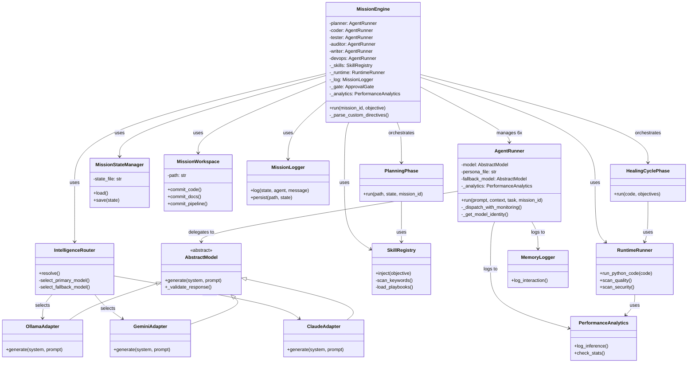
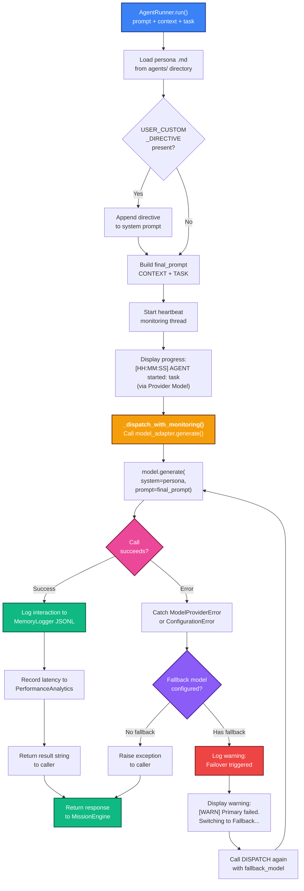
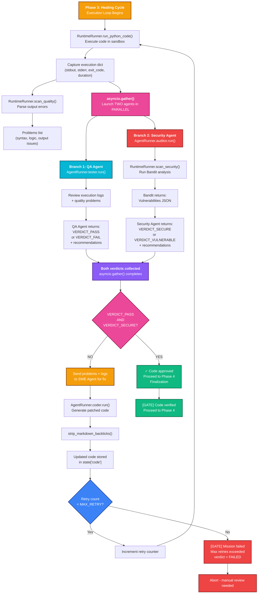

# Synapticity 3.3: Complete System Architecture & Visual Diagrams

**Version**: 3.3  
**Last Updated**: April 2026  
**Purpose**: Comprehensive visual reference for all system components, class hierarchies, data flows, and execution phases.

---

## Table of Contents

1. [Overview](#overview)
2. [What Happens Behind the Scenes - Mission Flow](#what-happens-behind-the-scenes---mission-flow)
3. [Core Class Hierarchy](#core-class-hierarchy)
4. [5-Phase Mission Execution Flow](#5-phase-mission-execution-flow)
5. [AgentRunner Dispatch & Failover](#agentrunner-dispatch--failover)
6. [Data Transformation Journey](#data-transformation-journey)
7. [Phase 3: Healing Cycle with Parallel QA & Security](#phase-3-healing-cycle-with-parallel-qa--security)
8. [Component Responsibilities](#component-responsibilities)
9. [System Integration Points](#system-integration-points)

---

## Overview

Synapticity is an **autonomous software generation and verification platform** built on a state-machine architecture. It orchestrates 6 specialized AI agents through 5 distinct phases:

- **Planning**: Product Manager designs architecture
- **Development**: Software Engineer writes code
- **Healing Cycle**: QA + Security agents verify in parallel with iterative fixes
- **Finalization**: Technical Writer + DevOps generate documentation and CI/CD
- **Self-Learning**: Reflection Engine extracts lessons for future missions

The system emphasizes modular extensibility, autonomous execution, and verified code delivery.

---

## What Happens Behind the Scenes - Mission Flow

When you launch a mission, here's what the system does internally, step by step:

### Step 1: You Launch a Mission

You type something like this:

```
python main.py launch my-project "Build a FastAPI REST server with authentication"
```

The system captures your goal (the objective) and a project ID (my-project).

### Step 2: Bootstrap - Everything Wakes Up

Before anything happens, the system does some housekeeping:

- **Check Available Models**: The IntelligenceRouter looks at your config to see what AI models are available. It could be Ollama running locally, or cloud services like Gemini or Claude. It picks a primary model and a backup in case the first one fails.
- **Create the Agent Team**: Six AgentRunner instances are created, one for each specialist (Planner, Coder, Tester, Auditor, Writer, DevOps). Each one knows how to talk to the AI and what persona to use.
- **Load Skills Registry**: The system loads all the technical playbooks from the skills folder based on keywords in your objective. If you said "FastAPI", it loads the FastAPI expert playbook. If you mentioned "microservices", it loads that too.
- **Initialize State File**: A state.json file is created in the project folder to track progress. This file is like the mission's "memory" - it remembers where we are and what we've done so far.

### Step 3: Phase 1 - Planning (Product Manager)

The Product Manager agent reads your objective and designs the architecture:

- Takes your goal: "Build a FastAPI REST server with authentication"
- Reads the FastAPI playbook from the skills folder
- Calls the AI model and says: "Design the architecture for this system. What files do we need? What dependencies? What data models?"
- The AI responds with a complete blueprint called specs.json
- This file contains:
  - System architecture overview
  - List of files to create (like main.py, router.py, models.py)
  - Required dependencies
  - Data models and schemas
  - Error handling strategy
- The specs.json is cached with a hash so if you run the same objective again, we skip this step and reuse the cached specs

### Step 4: Phase 2 - Development (Software Engineer)

Now the Software Engineer takes the blueprint and writes actual code:

- Reads the specs.json architecture
- Gets the FastAPI and authentication playbooks injected into context
- Calls the AI and says: "Write Python code that matches these specs"
- The AI returns raw code with markdown backticks around it
- The system strips the backticks to get clean Python code
- Saves the code to state.json['code'] for tracking
- All code is saved as state, not yet written to disk

### Step 5: Phase 3 - Healing Cycle (QA + Security)

This is where verification happens. The code isn't trusted until it passes both QA and Security checks:

- **Execute in Sandbox**: RuntimeRunner executes the generated code in an isolated Python environment with a timeout. If it crashes, hangs, or times out, we know.
- **Scan Quality**: The system parses the output looking for errors, exceptions, or unexpected behavior. It builds a list of problems if any were found.
- **Run QA and Security in Parallel**: Instead of doing them one after another, both happen at the same time:
  - QA Agent reads the execution output and any errors, reviews them, and gives a verdict: "PASS" or "FAIL"
  - Security Agent runs Bandit (a Python security scanner) on the code, looking for SQL injection, hardcoded passwords, insecure functions, etc. It gives a verdict: "SECURE" or "VULNERABLE"
- **Decision Point**: If both agents say PASS and SECURE, great, move on. If either one says FAIL or VULNERABLE, the system doesn't give up.
- **Feedback Loop**: The system collects all the problems and feedback, then calls the Software Engineer again and says: "Here's what went wrong. Fix it." The engineer generates a new version of the code.
- **Retry**: The new code is tested again. This loop continues up to a maximum number of retries (typically 3-5).
- **Bail Out**: If we hit max retries and still haven't passed, the mission fails and you get a report of what couldn't be fixed.

This healing cycle is why Synapticity produces robust code - it's tested and fixed in a loop until it actually works.

### Step 6: Phase 4 - Finalization (Writer + DevOps)

Once the code passes all checks, it's time to wrap it up for real use:

- **Generate Documentation**: The Technical Writer agent reads the specs and code, then generates PROJECT_GUIDE.md with:
  - How to set up the project
  - How to run it
  - What each module does
  - Examples and use cases
- **Generate Deployment**: The DevOps Engineer reads the code and generates GitHub Actions YAML files that:
  - Run automated tests on every commit
  - Deploy the code when you push to main
  - Send notifications if something fails
- **Commit to Workspace**: All artifacts are written to the /output/ folder:
  - main.py (or all the Python files)
  - PROJECT_GUIDE.md
  - main.yml (GitHub Actions workflow)
  - requirements.txt (auto-generated dependencies)
- **Mark as Complete**: The state.json gets verdict = "COMPLETED" and a timestamp

### Step 7: Phase 5 - Self-Learning (Reflector)

Right at the end, the system learns from what just happened:

- **Read the Mission Log**: The system reads MISSION_LOG.md which contains the entire history of what happened - every agent call, every result, every retry
- **Ask the Reflector Agent**: "Looking at this mission log, what lessons can we extract? What patterns worked? What could we do better next time?"
- **Update Knowledge Base**: The Reflector's insights are appended to the autonomous-lessons skill, which is read during future missions. So next time you say "Build a FastAPI server", the system will reference what worked last time.

### Summary of Backend Flow

```
User Input
    |
    v
Wakeup & Bootstrap (model selection, agent creation)
    |
    v
Phase 1: PM designs specs (architecture)
    |
    v
Phase 2: SWE writes code (implementation)
    |
    v
Phase 3: Execute + QA/Security in parallel (loop until pass)
    |
    v
Phase 4: Writer + DevOps finalize (docs + deployment)
    |
    v
Phase 5: Reflector learns (extract lessons)
    |
    v
Output Ready (code + docs + pipeline in /output/)
```

The whole process is deterministic - every step produces artifacts that are logged. If something fails, you can resume from that point. If something succeeds, those results are cached and reused.

---

## Core Class Hierarchy

### Visual Class Diagram



### Key Components

#### `MissionEngine`
**Role**: The central control room that manages the full development lifecycle.

**What it does**: It's like a movie director who coordinates all the actors (agents) and makes sure they do their jobs in the right order. It keeps track of state, makes decisions about when to move to the next phase, and checks gates to ensure quality.

**Attributes**:
- 6 `AgentRunner` instances (Planner, Coder, Tester, Auditor, Writer, DevOps)
- `IntelligenceRouter`: picks which AI model to use (local or cloud)
- `SkillRegistry`: loads relevant technical playbooks for the job
- `RuntimeRunner`: runs generated code in a sandbox to test it
- `MissionStateManager`: saves progress so you can pick up where you left off
- `MissionWorkspace`: manages files in the project folder
- `MissionLogger`: records everything that happens
- `ApprovalGate`: stops the flow if something is wrong

**Key Methods**:
- `run(mission_id, objective)`: Starts the whole mission, one phase after another
- `_parse_custom_directives()`: Extracts special instructions you put in your objective

#### `AgentRunner`
**Role**: The messenger who talks to the AI on behalf of each specialist.

**What it does**: It loads a persona file (like the Product Manager's personality), builds a prompt, sends it to the AI, and gets back a response. If the AI is offline or slow, it automatically tries a backup AI.

**Attributes**:
- `model`: The main AI model (could be Ollama, Gemini, or Claude)
- `fallback_model`: A backup AI in case the first one fails
- `persona_file`: A text file containing the agent's instructions
- `_analytics`: Tracks how long each call takes

**Key Methods**:
- `run(prompt, context, task)`: Sends a task to the agent with background information
- `_dispatch_with_monitoring()`: Makes the actual call to the AI while showing progress on screen
- Has automatic failover logic built in

#### `IntelligenceRouter`
**Role**: The matchmaker between the system and AI models.

**What it does**: Looks at what you configured and what's available, then picks the best AI model. If you have Ollama running locally, it uses that (free, fast, private). If Ollama is down, it falls back to cloud services like Gemini or Claude.

**Methods**:
- `resolve()`: Returns a pair of models - primary and fallback
- Considers user preferences, local availability, and performance history

#### Model Adapters (`AbstractModel`, `OllamaAdapter`, `GeminiAdapter`, `ClaudeAdapter`)
**Role**: Translation layers that speak the language of different AI services.

**What it does**: Different AI providers (Ollama, Google, Anthropic) have slightly different APIs. These adapters normalize them so the rest of Synapticity doesn't care which one is used. It's like having translators for different languages.

#### `SkillRegistry`
**Role**: The reference librarian for technical knowledge.

**What it does**: When you mention "FastAPI" or "microservices" in your objective, this system scans your words and loads the corresponding technical playbooks from the skills folder. These playbooks contain best practices, patterns, and common pitfalls for that technology.

**Methods**:
- `inject(objective)`: Reads your goal, finds matching keywords, loads playbooks
- Returns a context string that gets passed to agents

#### `RuntimeRunner`
**Role**: The sandbox that executes untrusted code safely.

**What it does**: Takes the Python code generated by the engineer and runs it in an isolated environment with a timeout. It captures everything that happens - what gets printed, what errors occur, how long it takes. Then it analyzes the results.

**Methods**:
- `run_python_code(code)`: Executes code, captures output and errors
- `scan_quality()`: Looks for error messages and problems
- `scan_security()`: Runs Bandit to find vulnerabilities

#### `MissionStateManager`
**Role**: The archivist that saves your progress.

**What it does**: Saves everything important to a state.json file so if the system crashes or you stop it, you can resume later. No work is lost.

**Methods**:
- `load()`: Reads the state file from disk
- `save(state)`: Writes the state file back to disk

#### `MissionWorkspace`
**Role**: File manager for the project output.

**What it does**: Creates and manages the /output/ directory where your finished code, documentation, and CI/CD pipelines go.

**Methods**:
- `commit_code()`: Writes Python files to /output/
- `commit_docs()`: Writes PROJECT_GUIDE.md
- `commit_pipeline()`: Writes GitHub Actions YAML

---

---

## 5-Phase Mission Execution Flow

### Visual Flow Diagram

```mermaid
graph TD
    START["User Launches Mission<br/>(objective + mission_id)"]

    START --> BOOT["<b>Stage 0: Bootstrap</b><br/>IntelligenceRouter.resolve()<br/>Creates 6x AgentRunners<br/>Initializes SkillRegistry & RuntimeRunner"]

    BOOT --> PHASE1["<b>Phase 1: Planning</b><br/>PlanningPhase.run()"]
    PHASE1 --> P1["1. MissionStateManager.load()"]
    P1 --> P2["2. SkillRegistry.inject(objective)"]
    P2 --> P3["3. AgentRunner planner.run()"]
    P3 --> P4["4. PM Agent generates specs"]
    P4 --> P5["5. specs.json written to disk"]
    P5 --> P5CHECK{specs cached<br/>already?}
    P5CHECK -->|Yes, skip| PHASE2
    P5CHECK -->|No, compute| P5

    PHASE2["<b>Phase 2: Development</b>"]
    PHASE2 --> D1["1. SkillRegistry.inject(specs)"]
    D1 --> D2["2. AgentRunner coder.run()"]
    D2 --> D3["3. SWE Agent generates code"]
    D3 --> D4["4. strip_markdown_backticks()"]
    D4 --> D5["5. state['code'] = code"]
    D5 --> STATE_SAVE1["MissionStateManager.save()"]

    STATE_SAVE1 --> PHASE3["<b>Phase 3: Healing Cycle</b><br/>(QA & Security Loop)"]
    PHASE3 --> H1["1. RuntimeRunner.run_python_code()"]
    H1 --> H2["2. RuntimeRunner.scan_quality()"]
    H2 --> H3["3. asyncio.gather: Run QA + Security<br/>in PARALLEL"]
    H3 --> H3A["QA Agent reviews output"]
    H3 --> H3B["Security Agent runs Bandit"]
    H3A --> H4["4. Check VERDICT"]
    H3B --> H4
    H4 -->|FAIL| H5["5. AgentRunner coder.run()<br/>(fix remediation)"]
    H5 --> H6["6. Increment retry counter"]
    H6 --> H1
    H4 -->|PASS & SECURE| STATE_SAVE2["MissionStateManager.save()"]

    STATE_SAVE2 --> PHASE4["<b>Phase 4: Finalization</b>"]
    PHASE4 --> F1["1. AgentRunner writer.run()"]
    F1 --> F2["2. Technical Writer generates<br/>PROJECT_GUIDE.md"]
    F2 --> F3["3. AgentRunner devops.run()"]
    F3 --> F4["4. DevOps generates GitHub Actions YAML"]
    F4 --> F5["5. MissionWorkspace.commit_code()"]
    F5 --> F6["6. MissionWorkspace.commit_docs()"]
    F6 --> F7["7. MissionWorkspace.commit_pipeline()"]
    F7 --> F8["8. state['verdict'] = 'COMPLETED'"]
    F8 --> STATE_SAVE3["MissionStateManager.save()"]

    STATE_SAVE3 --> PHASE5["<b>Phase 5: Self-Learning</b>"]
    PHASE5 --> L1["1. ReflectionEngine.analyze()"]
    L1 --> L2["2. Read MISSION_LOG.md"]
    L2 --> L3["3. AgentRunner reflector.run()"]
    L3 --> L4["4. Extract lessons & patterns"]
    L4 --> L5["5. Append to autonomous-lessons skill.md"]
    L5 --> END["<b>Mission Complete</b><br/>Output ready for deployment"]

    style START fill:#10b981,stroke:#065f46,stroke-width:2px,color:#fff
    style BOOT fill:#3b82f6,stroke:#1e3a8a,stroke-width:2px,color:#fff
    style PHASE1 fill:#8b5cf6,stroke:#4c1d95,stroke-width:2px,color:#fff
    style PHASE2 fill:#06b6d4,stroke:#164e63,stroke-width:2px,color:#fff
    style PHASE3 fill:#f59e0b,stroke:#78350f,stroke-width:2px,color:#fff
    style PHASE4 fill:#ec4899,stroke:#831843,stroke-width:2px,color:#fff
    style PHASE5 fill:#14b8a6,stroke:#134e4a,stroke-width:2px,color:#fff
    style END fill:#10b981,stroke:#065f46,stroke-width:2px,color:#fff
```



### Phase Descriptions

#### Phase 1: Planning
**Input**: User objective + mission_id  
**Output**: `specs.json` (architectural blueprint)  
**Agent**: Product Manager

- Load or create mission state
- Scan objective for keywords to trigger skill injection
- Product Manager generates architectural specifications
- Caching: skip if specs.json already exists (hash-based)

#### Phase 2: Development
**Input**: `specs.json`  
**Output**: `state['code']` (verified Python source)  
**Agent**: Software Engineer

- Inject relevant playbooks into context
- Software Engineer generates raw code
- Strip markdown backticks to extract clean code
- Save code to state.json

#### Phase 3: Healing Cycle
**Input**: `state['code']`  
**Output**: Hardened code + VERDICT  
**Agents**: QA + Security (parallel)

- Execute code in sandbox
- **asyncio.gather()** runs QA and Security agents simultaneously
- QA: Reviews execution logs and quality issues
- Security: Runs Bandit vulnerability scanner
- If both pass, proceed; else loop back to SWE for remediation
- Max retry safeguard prevents infinite loops

#### Phase 4: Finalization
**Input**: `specs.json` + `state['code']`  
**Output**: PROJECT_GUIDE.md + main.yml  
**Agents**: Technical Writer + DevOps Engineer

- Technical Writer: Generate markdown documentation
- DevOps Engineer: Generate GitHub Actions YAML
- Commit all artifacts to /output/
- Set verdict to COMPLETED

#### Phase 5: Self-Learning
**Input**: MISSION_LOG.md  
**Output**: Updated autonomous-lessons skill.md  
**Agent**: Reflector

- Analyze mission log for patterns and lessons
- Reflector extracts insights
- Append lessons to skill repository for future missions

---

## AgentRunner Dispatch & Failover

### Visual Dispatch Flow



### Key Features

1. **Persona Injection**: Loads agent-specific system prompt from `.md` files
2. **Custom Directives**: Appends user-provided task overrides to system context
3. **Live Monitoring**: Displays progress with timestamps and model identity
4. **Automatic Failover**: If primary model fails, seamlessly switches to fallback provider
5. **Interaction Logging**: Every call is recorded to JSONL for audit and learning
6. **Performance Tracking**: Latency metrics collected for analytics

---

## Data Transformation Journey

### Visual Data Flow

```mermaid
graph LR
    INPUT["<b>Input</b><br/>User Mission String<br/>+ objective"]
    
    INPUT --> STATE["<b>state.json</b><br/>mission_id<br/>phase<br/>objective<br/>specs<br/>code<br/>verdict"]
    
    STATE --> SKILLS["<b>SkillRegistry</b><br/>.inject()"]
    SKILLS --> CONTEXT["<b>Context String</b><br/>Matched playbooks<br/>+ engineering rules<br/>+ persona"]
    
    CONTEXT --> PROMPT["<b>Monolithic Prompt</b><br/>system: persona<br/>+ custom_directive<br/>prompt: context + task"]
    
    PROMPT --> MODEL["<b>Model.generate()</b><br/>OllamaAdapter<br/>GeminiAdapter<br/>ClaudeAdapter"]
    
    MODEL --> SPECS["<b>specs.json</b><br/>Architecture<br/>File structure<br/>Dependencies<br/>Data models"]
    
    SPECS --> CODE["<b>Raw Code String</b><br/>Markdown backticks<br/>Multiple files<br/>Comments & docstrings"]
    
    CODE --> STRIP["<b>strip_markdown_backticks()</b><br/>Clean Python code"]
    STRIP --> CLEAN_CODE["<b>state['code']</b><br/>Verified source<br/>Ready to execute"]
    
    CLEAN_CODE --> RUNTIME["<b>RuntimeRunner</b><br/>.run_python_code()"]
    
    RUNTIME --> EXEC_RESULT["<b>Execution Dict</b><br/>stdout<br/>stderr<br/>exit_code<br/>duration"]
    
    EXEC_RESULT --> QA_CHECK["<b>QA Analysis</b><br/>.scan_quality()"]
    EXEC_RESULT --> SEC_CHECK["<b>Security Scan</b><br/>.scan_security()"]
    
    QA_CHECK --> QA_VERDICT["VERDICT_PASS<br/>or FAIL"]
    SEC_CHECK --> SEC_VERDICT["VERDICT_SECURE<br/>or VULNERABLE"]
    
    QA_VERDICT --> DECISION{Both<br/>PASS?}
    SEC_VERDICT --> DECISION
    
    DECISION -->|Yes| FINAL_CODE["<b>Hardened Source Code</b><br/>Ready for deployment"]
    DECISION -->|No| FEEDBACK["Logs + problems<br/>sent to coder<br/>for remediation"]
    FEEDBACK --> CODE
    
    FINAL_CODE --> DOCS["<b>Documentation</b><br/>PROJECT_GUIDE.md<br/>Generated by Writer"]
    FINAL_CODE --> DEPLOY_CONFIG["<b>Deployment Config</b><br/>GitHub Actions YAML<br/>Generated by DevOps"]
    
    DOCS --> REPO["<b>GitHub Repository</b><br/>/output/"]
    DEPLOY_CONFIG --> REPO
    FINAL_CODE --> REPO
    
    REPO --> REFLECTION["<b>ReflectionEngine</b><br/>Analyzes MISSION_LOG.md"]
    REFLECTION --> LESSONS["<b>Autonomous Lessons</b><br/>Appended to<br/>autonomous-lessons skill.md"]
    
    style INPUT fill:#10b981,stroke:#065f46,stroke-width:2px,color:#fff
    style STATE fill:#3b82f6,stroke:#1e3a8a,stroke-width:2px,color:#fff
    style SKILLS fill:#8b5cf6,stroke:#4c1d95,stroke-width:2px,color:#fff
    style CONTEXT fill:#8b5cf6,stroke:#4c1d95,stroke-width:2px,color:#fff
    style PROMPT fill:#06b6d4,stroke:#164e63,stroke-width:2px,color:#fff
    style MODEL fill:#06b6d4,stroke:#164e63,stroke-width:2px,color:#fff
    style SPECS fill:#ec4899,stroke:#831843,stroke-width:2px,color:#fff
    style CODE fill:#f59e0b,stroke:#78350f,stroke-width:2px,color:#fff
    style STRIP fill:#f59e0b,stroke:#78350f,stroke-width:2px,color:#fff
    style CLEAN_CODE fill:#10b981,stroke:#065f46,stroke-width:2px,color:#fff
    style RUNTIME fill:#06b6d4,stroke:#164e63,stroke-width:2px,color:#fff
    style EXEC_RESULT fill:#f59e0b,stroke:#78350f,stroke-width:2px,color:#fff
    style DECISION fill:#ec4899,stroke:#831843,stroke-width:2px,color:#fff
    style FINAL_CODE fill:#10b981,stroke:#065f46,stroke-width:2px,color:#fff
    style REPO fill:#14b8a6,stroke:#134e4a,stroke-width:2px,color:#fff
    style REFLECTION fill:#8b5cf6,stroke:#4c1d95,stroke-width:2px,color:#fff
    style LESSONS fill:#10b981,stroke:#065f46,stroke-width:2px,color:#fff
```



### Transformation Steps

| Step | Input | Process | Output |
|------|-------|---------|--------|
| 1 | Mission string | Parse objective + directives | state.json |
| 2 | Objective | Keyword scanning | Matched skills |
| 3 | Skills + objective | Context injection | Prompt context |
| 4 | Context + persona | Model generation | specs.json |
| 5 | specs.json + context | Code generation | Raw code string |
| 6 | Raw code | Markdown cleanup | Clean Python code |
| 7 | Clean code | Sandbox execution | Execution result |
| 8 | Execution result | Quality + security analysis | VERDICT |
| 9 | VERDICT | Gate decision | Remediate or finalize |
| 10 | Finalized code | Write docs + pipeline | Project artifacts |
| 11 | Mission log | Reflection analysis | Lessons learned |

---

## Phase 3: Healing Cycle with Parallel QA & Security

### Visual Healing Cycle



### Healing Cycle Details

**What makes this phase special**:

1. **Parallel Execution**: QA and Security agents run simultaneously using `asyncio.gather()`, not sequentially
2. **Feedback Loop**: Failed verdicts trigger automatic remediation attempts
3. **Safety Net**: Max retry counter prevents infinite loops
4. **Approval Gate**: Code must pass BOTH QA and Security before proceeding

**Key Decisions**:

- **VERDICT_PASS**: Code executed without errors
- **VERDICT_SECURE**: Bandit found no critical vulnerabilities
- **Both True**: Proceed to Phase 4
- **Either False**: Collect logs + recommendations, send to SWE for fix, loop

**Remediation Loop**:

1. Collect execution logs, quality problems, security issues
2. Call SWE Agent with comprehensive feedback
3. SWE generates patched code
4. Strip backticks and save to state['code']
5. Increment retry counter
6. Re-execute if under MAX_RETRY threshold

---

## Component Responsibilities

### The Agent Team (in `/agents/`)

Each agent is a personality that knows how to do one specific job:

| Agent | File | What They Do |
|-------|------|--------------|
| **Product Manager** | `product-manager.md` | Reads your requirements and designs the overall architecture. Decides what files you need, what data structures to use, what dependencies to include. |
| **Software Engineer** | `software-engineer.md` | Takes the architecture design and writes the actual Python code. Also fixes code when QA finds bugs. |
| **QA Tester** | `tester.md` | Runs the code and checks if it works. Looks for crashes, errors, unexpected behavior, or missing functionality. |
| **Security Auditor** | `oncall-engineer.md` | Runs security scanners on the code to find vulnerabilities like SQL injection, hardcoded secrets, or insecure functions. |
| **Technical Writer** | `writer.md` | Writes the PROJECT_GUIDE.md documentation explaining how to use the generated code. Makes it readable for humans. |
| **DevOps Engineer** | `devops-engineer.md` | Creates GitHub Actions files that automate testing and deployment. Sets up the pipeline so your code goes live automatically. |
| **Reflector** | `reflector.md` | After a mission completes, reads the logs and figures out what went well and what could improve. Teaches the system for next time. |
| **Orchestrator** | `orchestrator.md` | Oversees everything. Makes sure all agents follow the architecture rules and don't do anything risky. |

### System Utilities (in `synaptic/utils/`)

These are helper tools that don't have their own persona but do important work:

| Tool | What It Does |
|------|--------------|
| `SynapticDoctor` | Checks that your environment is set up correctly - that your Python version is right, your AI keys work, and you have internet connection if needed. |
| `GitDeployer` | Automatically initializes a GitHub repository for your project and pushes the generated code. |
| `ProjectIndexer` | Reads an existing project's files and summarizes them so the AI agents can understand what's already there. Used for the "review" command. |
| `MemoryLogger` | Records every conversation between agents and AI models. Creates a detailed audit trail in JSON format. |
| `SensoryCortex` | (Coming later) Will browse the internet to find documentation for libraries you're using and pass it to agents. |
| `MetabolicManager` | (Coming later) Will manage a pool of API keys to make sure you don't hit rate limits when using cloud AI services. |

### What Gets Saved Where

Different pieces of the system save different things:

| Component | Saves | Format | Location |
|-----------|-------|--------|----------|
| `MissionStateManager` | Project progress, phase tracking, specs and code | JSON | `workspace/[mission-id]/state.json` |
| `MissionLogger` | Detailed action log and timeline | Markdown | `workspace/[mission-id]/MISSION_LOG.md` |
| `MemoryLogger` | Every AI interaction with full prompts/responses | JSON lines | `logs/` folder |
| `PerformanceAnalytics` | How long things take, resource usage, timing data | JSON | `workspace/performance_metrics.json` |

---

## System Integration Points

### Phase Boundaries (Gates)

Each phase boundary includes an `ApprovalGate` that validates state transitions:

| Gate | Validates | Blocks On |
|------|-----------|-----------|
| After Phase 1 | `state['specs']` exists | Null or invalid specs |
| After Phase 2 | `state['code']` exists | Null or invalid Python |
| After Phase 3 | `VERDICT_PASS` AND `VERDICT_SECURE` | Failed QA or security checks |
| After Phase 4 | Output files exist | Missing docs or CI/CD |
| After Phase 5 | Lessons appended | Analysis failures |

### Skill Injection Points

**Phase 1 (Planning)**:
```
SkillRegistry.inject(objective)
→ Scans for keywords like "fastapi", "async", "microservices"
→ Loads matching playbooks from skills/ folder
→ Injects into Product Manager context
```

**Phase 2 (Development)**:
```
SkillRegistry.inject(specs + objective)
→ Matches architecture patterns to engineering playbooks
→ Injects into Software Engineer context
```

### Fallback Strategy

**Primary Model Path**:
```
IntelligenceRouter.resolve() 
→ Returns (primary_model, fallback_model)
→ Each AgentRunner configured with both
```

**Failover Trigger**:
```
AgentRunner.run() 
→ Try primary model
→ On error: Switch to fallback
→ On fallback error: Raise to caller
```

**Model Selection Logic**:
- Check user config (PREFERRED_MODEL env var)
- Check local Ollama availability
- Fall back to cloud provider (Gemini or Claude)

---

## Summary

Synapticity's architecture is built on these core ideas:

1. **Modularity**: Seven agents plus infrastructure components work independently. You can swap out one without breaking others.
2. **Autonomy**: The system runs a complete 5-phase pipeline from start to finish without asking you for approval at each step.
3. **Verification**: Code doesn't get trusted until it passes both QA and Security checks running in parallel.
4. **Resilience**: If the local AI model fails, it smoothly switches to a cloud provider without interrupting the mission.
5. **Learning**: After each mission, the system extracts lessons and stores them so future missions benefit from past experience.
6. **Transparency**: Every step is logged. You can see what happened, when it happened, and why.

The important thing to understand is that every execution path is deterministic and recoverable. If something breaks halfway through, you can pick up exactly where you left off. And the entire process is auditable - you can trace any line of generated code back to which agent created it and why.

