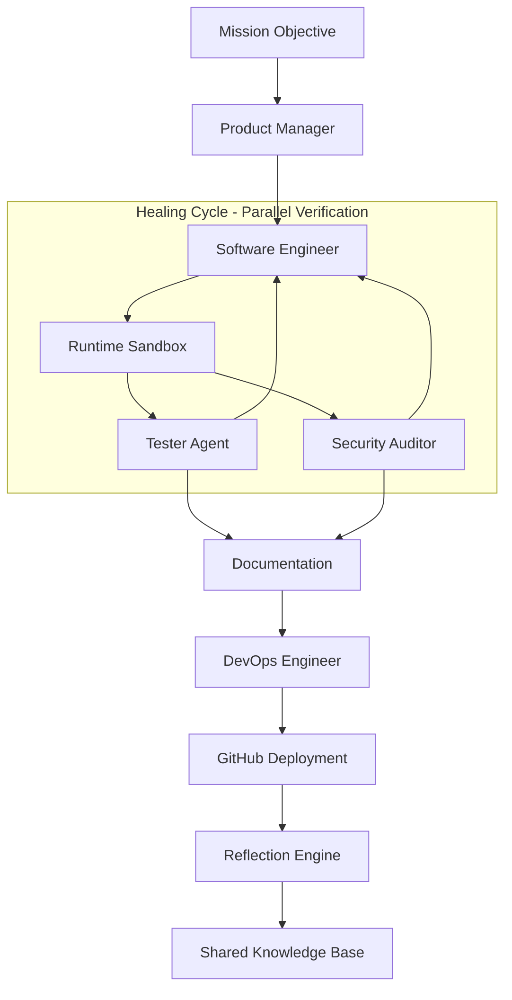
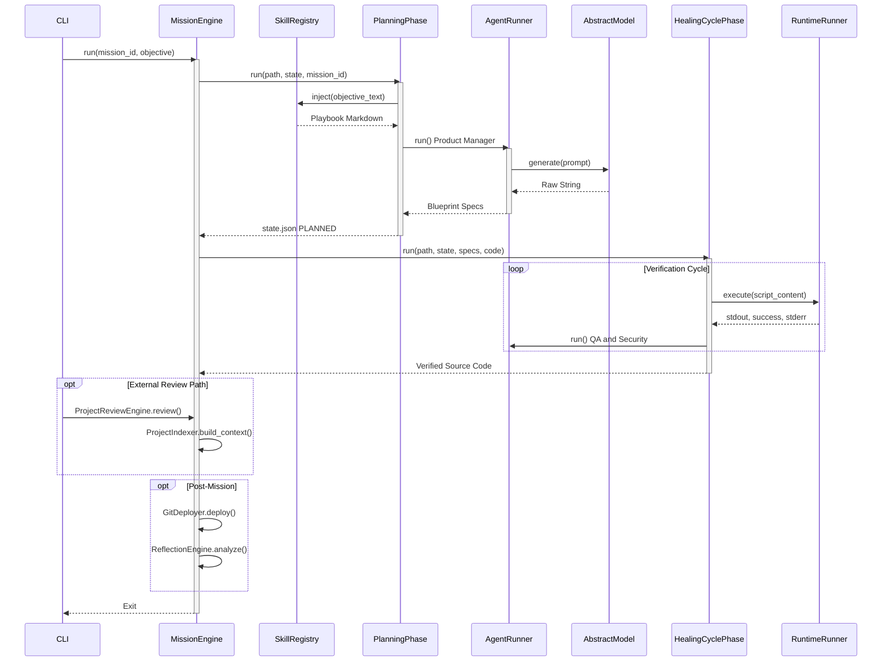

# Synapticity: Technical Framework Overview (v3.3)

## Executive Summary

Synapticity is an autonomous software development framework built for production use. Think of it as a bridge between your high-level ideas and a verified, ready-to-use codebase. By orchestrating a specialized team of AI agents, it essentially automates the entire software factory process—from planning the initial architecture all the way to deploying it with cloud-native CI/CD pipelines.

### The "Smart Factory" Model
Rather than a chat assistant, Synapticity treats software development like a rigorous manufacturing process:
- **Core Reasoning**: We use high-density local and cloud-based Large Language Models (LLMs) to power the team.
- **Service Adapters**: Pluggable interfaces allow us to easily swap between Ollama (local), Gemini, and Claude.
- **Specialized Personas**: Our agents act like a real team (Product Manager, Software Engineer, QA, Security), each with their own unique expertise and constraints.
- **Dynamic Playbooks**: We inject domain-specific "Skills" directly into the agents' context right when they need them.
- **Self-Healing Loop**: If something breaks, the verification agents flag the issue, and the system automatically remediates the code in a secure sandbox.

---

## Intelligence & Workflow Architecture

The framework operates on a state-machine orchestrator that strictly enforces a "Verification-First" culture. We guarantee that no mission code is finalized until it successfully passes through both functional and security testing gates.

### Method-Level Execution Breakdown

To understand how high-level goals translate into verifiable code, we must examine the specific methods driving the orchestrator. The `MissionEngine` acts as the traffic controller, routing execution across distinct, asynchronous Python methods.

#### 1. `MissionEngine.run(mission_id: str, objective: str)`
> **The Big Boss & State Controller**
>
> - **Role & Responsibility:** This is the front door to the factory. It sets up your secure workspace, orchestrates all 5 phases of development, and makes sure we never lose your progress.
> - **Dependencies:** It works hand-in-hand with `MissionStateManager` (to save your progress) and the `AgentDispatcher` (to assign tasks to the AI team).
> - **Execution Context:** It runs the second you press enter on `synaptic launch` or `resume`. Think of it as the top-level conductor of the whole operation.
> - **Example Story:** You ask the CLI to "Build a FastAPI JWT router." The Engine assigns it `mission_id: "001-auth-api"`, creates a blank folder, and updates our `state.json` tracker to say we are officially in the `"PLANNED"` phase.

#### 2. `PlanningPhase.run(path: str, state: dict, mission_id: str) -> str`
> **The Architectural Synthesizer**
>
> - **Role & Responsibility:** It takes your rough, human idea and translates it into a strict, highly technical blueprint mapping out exactly what files and functions need to be written.
> - **Dependencies:** It commands the `Product Manager` agent and relies heavily on the `SkillRegistry` to know what best practices to apply.
> - **Execution Context:** Runs immediately in Phase 1 before a single line of actual code is allowed to be synthesized.
> - **Example Story:** The Planner takes `"Build a FastAPI JWT router"`. It asks the Skill Registry for help, and outputs a strict Markdown blueprint: `"We need an auth.py file with a POST /login endpoint returning a 401 on failure."`

#### 3. `AgentRunner.run(system_prompt: str, context: str, task: str) -> str`
> **The AI Dispatcher**
>
> - **Role & Responsibility:** It takes the massive text prompts, figures out which AI (like Gemini or Ollama) should answer, securely sends the request, and cleans up the AI's response so our system can read it.
> - **Dependencies:** It uses `AbstractModel` to talk to our cloud or local providers, and loads up specific `.yaml` files depending on whether it needs a QA tester or a Coder.
> - **Execution Context:** Invoked constantly in the background every single time an agent needs to "think" or write a response.
> - **Example Story:** The runner grabs the blueprint from Step 2, bundles it with the "Software Engineer" persona, sends it to the AI, and gets back a raw Python script containing the `def login():` logic.

#### 4. `HealingCyclePhase.run(path: str, state: dict, specs: str, code: str) -> str`
> **The Autonomous QA & Fixer Loop**
>
> - **Role & Responsibility:** A relentless loop that forces the generated code through extreme parallel QA and Security testing. If it breaks, it tells the SWE agent to fix it. It repeats until the code is perfect.
> - **Dependencies:** Relies on `asyncio.gather` for parallel testing, the `RuntimeRunner` for isolated test sandboxes, and the Tester/Security agents.
> - **Execution Context:** Runs during Phase 3. It will strictly refuse to let the mission finish until it sees a `[PASS]` from both QA and Security.
> - **Example Story:** The developer agent wrote the script, but forgot to hash the password. The Security agent yells `[FAIL] (CWE-256)`. The developer patches it. This loop continues until we finally have the perfect, secure JWT auth code.

#### 5. `RuntimeRunner.execute(script_content: str) -> dict`
> **The Isolated Sandbox**
>
> - **Role & Responsibility:** A security-first perimeter that safely runs whatever untrusted code the AI just hallucinated inside an isolated shell, protecting your computer.
> - **Dependencies:** Direct integration with your OS's Python shell via `subprocess` or a Docker container.
> - **Execution Context:** Triggered multiple times a second during the Healing Cycle to see if the code physically compiles and runs.
> - **Example Story:** The code from our JWT router is sent here. The sandbox boots up a temporary FastAPI server, hits the endpoint, and returns a JSON report: `{"success": True, "stdout": "Server started on 8000..."}`.

#### 6. `ProjectReviewEngine.review(project_path: str, goal: str, mission_id: str) -> str`
> **The Codebase Auditor**
>
> - **Role & Responsibility:** Give it an existing project folder, and it will read every file, figure out how it works, and physically write code patches to fix bugs or add new features.
> - **Dependencies:** Chains together the `ProjectIndexer` (to read your files) and `AgentRunner` (to figure out what to fix).
> - **Execution Context:** This runs entirely outside the standard mission. You trigger it manually via the CLI `review` command when working on your own external projects.
> - **Example Story:** You point the CLI to your existing Django forum app and say "Add the JWT auth here." It scans the forum app, finds your `urls.py`, and outputs a ready-to-merge `FILE_PATCH`.

#### 7. `ProjectIndexer.build_context() -> str`
> **The Filesystem Packer**
>
> - **Role & Responsibility:** Sweeps through your entire app folder (ignoring heavy stuff like virtual environments) and compresses the structure and text into one giant string the AI can read.
> - **Dependencies:** Just standard Python `os` and `pathlib` tools.
> - **Execution Context:** Kicks off immediately when the `ProjectReviewEngine` starts so it can package up your code.
> - **Example Story:** It zips through all 15 files in your Python project and generates a clean text block: `// File: main.py\nimport fastapi...\n// End File` so the AI knows exactly what it's working with.

#### 8. `ReflectionEngine.analyze(mission_id: str) -> str`
> **The "Lessons Learned" Journal**
>
> - **Role & Responsibility:** Once a mission is totally complete, it re-reads the entire chat history specifically looking for mistakes the AI made, and saves them as rules so it never makes that mistake again.
> - **Dependencies:** Aggressively reads from our `MissionLogger` JSONL files.
> - **Execution Context:** Always runs automatically in Phase 5 right before the framework shuts down.
> - **Example Story:** It notices the Developer agent failed the JWT security test three times because it forgot to set the Token expiration. It writes a rule: `"If building JWT, ALWAYS set an exp claim."`

#### 9. `SkillRegistry.inject(objective_text: str) -> str`
> **The Domain Knowledge Portal**
>
> - **Role & Responsibility:** Instantly searches through our markdown playbooks to find technical rules that match what the user is asking for, injecting them into the AI's brain.
> - **Dependencies:** Relies on basic text keyword matching targeting files in the `/skills/` folder.
> - **Execution Context:** Fires instantly during Phase 1 so the architectural planner knows the rules before it starts making decisions.
> - **Example Story:** It scans `"Build a FastAPI JWT router"`. It sees "FastAPI", grabs `fastapi-playbook.md`, and secretly tells the AI: `"Hey, remember to use APIRouter here!"`

#### 10. `GitDeployer.deploy() -> bool`
> **The Automated DevOps Tool**
>
> - **Role & Responsibility:** Connects to GitHub, creates a brand new repository, automatically initializes git locally, and pushes the new code live to the web.
> - **Dependencies:** Requires your computer to have `git` installed, plus a `GITHUB_TOKEN` in your `.env` file.
> - **Execution Context:** Runs at the very end of Phase 4, but only if you told the CLI you wanted to deploy to the cloud.
> - **Example Story:** The final JWT code looks great. The deployer runs `git init`, creates `github.com/YourName/001-auth-api`, and automatically pushes the `main` branch live.

#### 11. `GeminiAdapter.generate(system: str, prompt: str) -> str` 
> **The AI Translator**
>
> - **Role & Responsibility:** The fundamental network layer that converts our system's raw Python text into a specifically formatted network request that Gemini, Claude, or Ollama can understand.
> - **Dependencies:** Third-party vendor toolkits like the `google-genai` or Anthropic SDK.
> - **Execution Context:** Running constantly. It is the final absolute barrier before our data actually leaves our system and hits the AI's brain.
> - **Example Story:** It takes our massive block of JWT context, packages it into a `model.generate_content()` web request, shoots it to Google's servers, and returns the AI's text response for us to use.

### Component Innovation
- **Asynchronous Monitoring**: We use background heartbeats and non-blocking model pre-warming to ensure the CLI status updates instantly without any noticeable lag.
- **Parallel Dispatch**: The Healing Cycle sends out the Functional QA and Security Audit tasks at exactly the same time, which cuts down the total verification time immensely.
- **Meta-Cognition Reflection**: After a mission finishes, a Reflection Engine looks back at the interactions to automatically synthesize new "Lessons." This allows the team to literally self-improve from task to task.

---

## Design Philosophy: SOLID & Agentic

We wrote this framework closely adhering to **SOLID** and **DRY** development principles:
- **Single Responsibility**: Every part has its lane. Individual managers handle state, logs, workspace, and model communication independently.
- **Dependency Inversion**: Our high-level orchestration doesn't care whether you're using Gemini or Ollama; it's completely decoupled.
- **Open-Closed Pattern**: Want to add a new command, agent, or model adapter? You can register them via a unified dispatch registry without needing to mess with the core logic.

---

## The Specialized Agent Pool

1.  **Product Manager**: Goal-to-AC translation and architectural blueprinting.
2.  **Software Engineer**: Precision-engineered, zero-defect source code synthesis.
3.  **Tester Agent**: Structural and functional validation via real-world sandbox execution.
4.  **Security Auditor**: Vulnerability containment and static analysis (Bandit).
5.  **Technical Writer**: Narrative documentation and technical hand-off generation.
6.  **DevOps Engineer**: GitHub Actions synthesis and autonomous deployment pipelines.

---

## Security & Operational Guardrails

- **Warp-Speed Pre-warming**: Models are loaded into VRAM on startup to eliminate "Cold Start" latency.
- **Infinite Residency**: Models are locked in memory using `-1 keep_alive` for zero-cost instant response.
- **Isolated Sandboxing**: All generated code is executed in a temporary, isolated runtime before verification.
- **Administrator Gateway**: Critical operations (e.g., skill ingestion) are protected by a secure CLI passcode gate.

For deeper technical mapping, refer to the [architecture_map.md](architecture_map.md).
