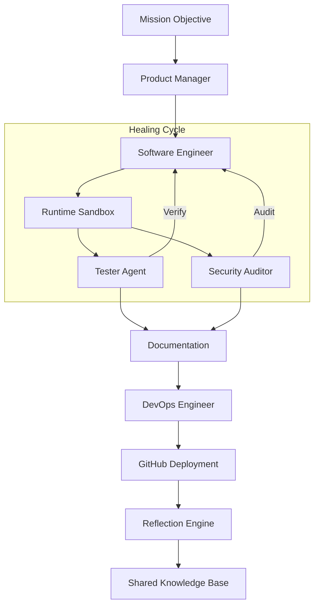
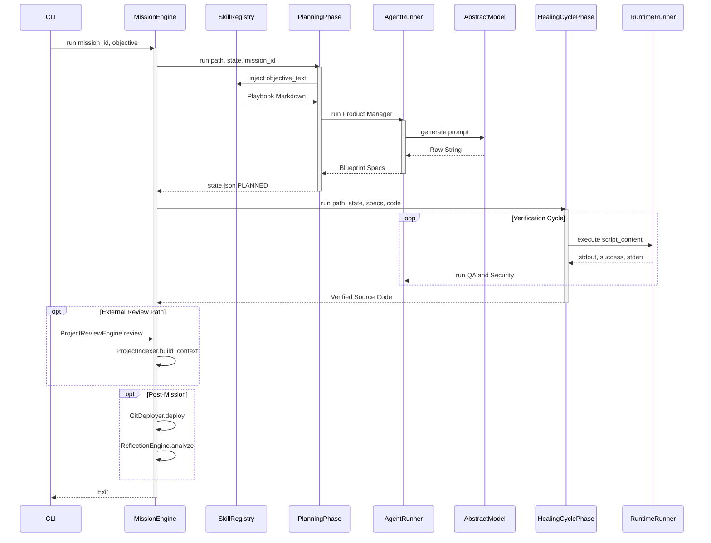

# Synapticity: Framework White Paper (v3.3)

## Summary

Synapticity is a tool for building software projects automatically. It works by managing a team of specialized AI agents. You give the system a high-level goal, and it handles everything from planning the architecture to testing and deploying the code.

### Core Features
- **Local and Cloud Support**: You can use local AI (Ollama) or cloud AI (Gemini/Claude).
- **Team-Based Design**: Each agent has a job, like "Software Engineer" or "Security Auditor."
- **Verification Gates**: The system tests all code in a sandbox to make sure it works before finishing.
- **Auto-Repair**: If a test fails, the system tries to fix the code automatically.

---

## Intelligence & Workflow Architecture

Synapticity operates as a state-machine orchestrator following a strict **"Verification-First"** culture. Software development is treated as a high-stakes mission where nothing is left to chance. Every line of code is synthesized from a blueprint and must successfully pass functional and security audits before it is permitted to join the repository.

The following diagram illustrates how a mission flows from a user objective to a hardened, production-ready product.

### Method-Level Execution Breakdown

To understand how high-level goals translate into verifiable code, the specific methods driving the orchestrator are examined below. The `MissionEngine` acts as the traffic controller, routing execution across distinct, asynchronous Python methods.

#### 1. `MissionEngine.run()` — The Conductor
> **Role:** This is the heart of the factory. It sets up the secure workspace, manages the 5-phase lifecycle, and ensures project progress is never lost.
>
> **Narrative:** When a mission is launched, the Engine assigns it a unique ID, builds a dedicated folder, and starts coordinating the team. It’s the top-level conductor that keeps the project in sync and on schedule.

#### 2. `PlanningPhase.run()` — The Architect
> **Role:** The Architect takes high-level ideas and translates them into a technical, structural blueprint.
>
> **Narrative:** Before code is written, a plan is made. The Architect scans the "Skill Registry" to find the best engineering practices for the specific stack (like FastAPI or React) and writes a master `specs.json` file. This is the blueprint that guides the rest of the factory.

#### 3. `AgentRunner.run()` — The Messenger
> **Role:** The Messenger handles the actual conversation with the AI. It packages up the right context, sends it off, and returns the answer in a clean, usable format.
>
> **Narrative:** Every time an agent needs to "think," the Messenger is at work. It figures out if it should use a local model like Ollama or a cloud one like Gemini, ensuring the status bar stays updated.

#### 4. `HealingCyclePhase.run()` — The Quality Controller
> **Role:** This is our relentless loop of testing, failure, and repair. No mission can finish until the code passes every single functional and security gate.
>
> **Narrative:** If the newly developed code has a bug or a security flaw, the Quality Controller catches it. It then assigns a "Software Engineer" to apply a patch and tries again. This loop continues autonomously until the code is rock-solid.

#### 5. `RuntimeRunner.execute()` — The Sandbox
> **Role:** A safe, isolated environment where experimental code is run without risking the computer's health.
>
> **Narrative:** Before any AI-generated code is trusted, it is tested in the Lab. The Sandbox boots it up, records what it does, and reports back. If it crashes or tries to do something suspicious, the sandbox contains it safely.

#### 6. `ProjectReviewEngine.review(project_path: str, goal: str, mission_id: str) -> str`
> **The Codebase Auditor**
>
> - **Role & Responsibility:** Give it an existing project folder, and it will read every file, figure out how it works, and physically write code patches to fix bugs or add new features.
> - **Dependencies:** Chains together the `ProjectIndexer` (to read your files) and `AgentRunner` (to figure out what to fix).
> - **Execution Context:** This runs entirely outside the standard mission. You trigger it manually via the CLI `review` command when working on your own external projects.
> - **Example Story:** You point the CLI to your existing Django forum app and say "Add the JWT auth here." It scans the forum app, finds your `urls.py`, and outputs a ready-to-merge `FILE_PATCH`.

#### 7. `ProjectIndexer.build_context() -> str`
> **The Filesystem Packer**
>
> - **Role & Responsibility:** Sweeps through your entire app folder (ignoring heavy stuff like virtual environments) and compresses the structure and text into one giant string the AI can read.
> - **Dependencies:** Just standard Python `os` and `pathlib` tools.
> - **Execution Context:** Kicks off immediately when the `ProjectReviewEngine` starts so it can package up your code.
> - **Example Story:** It zips through all 15 files in your Python project and generates a clean text block: `// File: main.py\nimport fastapi...\n// End File` so the AI knows exactly what it's working with.

#### 8. `ReflectionEngine.analyze(mission_id: str) -> str`
> **The "Lessons Learned" Journal**
>
> - **Role & Responsibility:** Once a mission is totally complete, it re-reads the entire chat history specifically looking for mistakes the AI made, and saves them as rules so it never makes that mistake again.
> - **Dependencies:** Aggressively reads from our `MissionLogger` JSONL files.
> - **Execution Context:** Always runs automatically in Phase 5 right before the framework shuts down.
> - **Example Story:** It notices the Developer agent failed the JWT security test three times because it forgot to set the Token expiration. It writes a rule: `"If building JWT, ALWAYS set an exp claim."`

#### 9. `SkillRegistry.inject(objective_text: str) -> str`
> **The Domain Knowledge Portal**
>
> - **Role & Responsibility:** Instantly searches through our markdown playbooks to find technical rules that match what the user is asking for, injecting them into the AI's brain.
> - **Dependencies:** Relies on basic text keyword matching targeting files in the `/skills/` folder.
> - **Execution Context:** Fires instantly during Phase 1 so the architectural planner knows the rules before it starts making decisions.
> - **Example Story:** It scans `"Build a FastAPI JWT router"`. It sees "FastAPI", grabs `fastapi-playbook.md`, and secretly tells the AI: `"Hey, remember to use APIRouter here!"`

#### 10. `GitDeployer.deploy() -> bool`
> **The Automated DevOps Tool**
>
> - **Role & Responsibility:** Connects to GitHub, creates a brand new repository, automatically initializes git locally, and pushes the new code live to the web.
> - **Dependencies:** Requires your computer to have `git` installed, plus a `GITHUB_TOKEN` in your `.env` file.
> - **Execution Context:** Runs at the very end of Phase 4, but only if you told the CLI you wanted to deploy to the cloud.
> - **Example Story:** The final JWT code looks great. The deployer runs `git init`, creates `github.com/YourName/001-auth-api`, and automatically pushes the `main` branch live.

#### 11. `GeminiAdapter.generate(system: str, prompt: str) -> str` 
> **The AI Translator**
>
> - **Role & Responsibility:** The fundamental network layer that converts our system's raw Python text into a specifically formatted network request that Gemini, Claude, or Ollama can understand.
> - **Dependencies:** Third-party vendor toolkits like the `google-genai` or Anthropic SDK.
> - **Execution Context:** Running constantly. It is the final absolute barrier before our data actually leaves our system and hits the AI's brain.
> - **Example Story:** It takes our massive block of JWT context, packages it into a `model.generate_content()` web request, shoots it to Google's servers, and returns the AI's text response for us to use.

### Component Innovation
- **Asynchronous Monitoring**: The system uses background heartbeats and non-blocking model pre-warming to ensure the CLI status updates instantly.
- **Parallel Dispatch**: The Healing Cycle sends out the Functional QA and Security Audit tasks at exactly the same time, which cuts down the total verification time.
- **Meta-Cognition Reflection**: After a mission finishes, a Reflection Engine looks back at the interactions to automatically synthesize new "Lessons." This allows the team to self-improve from task to task.

---

## Design Philosophy: SOLID & Agentic

The framework is built using **SOLID** and **DRY** development principles:
- **Single Responsibility**: Every part has a primary focus. Individual managers handle state, logs, workspace, and model communication independently.
- **Dependency Inversion**: High-level orchestration is independent of whether Gemini or Ollama is used.
- **Open-Closed Pattern**: Commands, agents, or model adapters can be registered via a unified dispatch registry without modifying the core logic.

---

## The Specialized Agent Pool

1.  **Product Manager**: Goal-to-AC translation and architectural blueprinting.
2.  **Software Engineer**: Precision-engineered, zero-defect source code synthesis.
3.  **Tester Agent**: Structural and functional validation via real-world sandbox execution.
4.  **Security Auditor**: Vulnerability containment and static analysis (Bandit).
5.  **Technical Writer**: Narrative documentation and technical hand-off generation.
6.  **DevOps Engineer**: GitHub Actions synthesis and autonomous deployment pipelines.

---

## Security & Operational Guardrails

- **Warp-Speed Pre-warming**: Models are loaded into VRAM on startup to eliminate "Cold Start" latency.
- **Infinite Residency**: Models are locked in memory using `-1 keep_alive` for zero-cost instant response.
- **Isolated Sandboxing**: All generated code is executed in a temporary, isolated runtime before verification.
- **Administrator Gateway**: Critical operations (e.g., skill ingestion) are protected by a secure CLI passcode gate.

For deeper technical mapping, refer to the [architecture_map.md](architecture_map.md).
