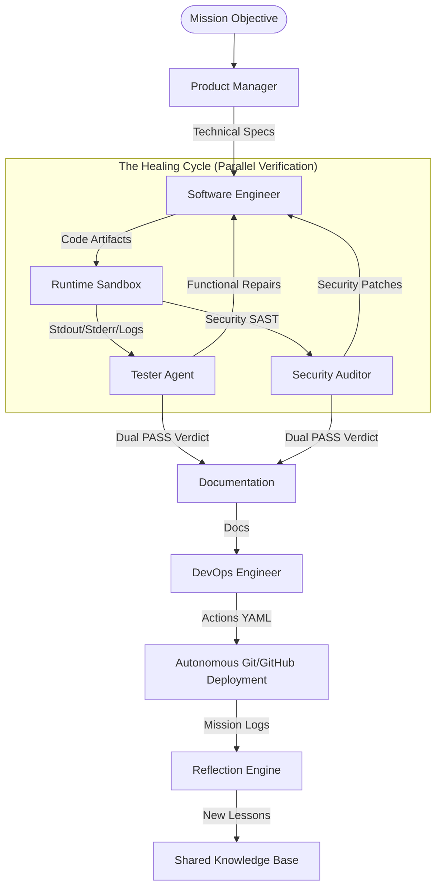

# Synapticity: Technical Framework Overview (v3.1)

## Executive Summary

Synapticity is an autonomous software development framework built for production use. Think of it as a bridge between your high-level ideas and a verified, ready-to-use codebase. By orchestrating a specialized team of AI agents, it essentially automates the entire software factory process—from planning the initial architecture all the way to deploying it with cloud-native CI/CD pipelines.

### The "Smart Factory" Model
Rather than a chat assistant, Synapticity treats software development like a rigorous manufacturing process:
- **Core Reasoning**: We use high-density local and cloud-based Large Language Models (LLMs) to power the team.
- **Service Adapters**: Pluggable interfaces allow us to easily swap between Ollama (local), Gemini, and Claude.
- **Specialized Personas**: Our agents act like a real team (Product Manager, Software Engineer, QA, Security), each with their own unique expertise and constraints.
- **Dynamic Playbooks**: We inject domain-specific "Skills" directly into the agents' context right when they need them.
- **Self-Healing Loop**: If something breaks, the verification agents flag the issue, and the system automatically remediates the code in a secure sandbox.

---

## Intelligence & Workflow Architecture

The framework operates on a state-machine orchestrator that strictly enforces a "Verification-First" culture. We guarantee that no mission code is finalized until it successfully passes through both functional and security testing gates.

### Method-Level Execution Breakdown

To understand how high-level goals translate into verifiable code, we must examine the specific methods driving the orchestrator. The `MissionEngine` acts as the traffic controller, routing execution across distinct, asynchronous Python methods.

**1. `MissionEngine.run(mission_id: str, objective: str)`**
This is the primary entry point that instantiates the workspace and initializes the state machine.
- **Input Sample:** `mission_id = "001-auth-api"`, `objective = "Build a FastAPI JWT authentication router."`
- **Output Sample:** Modifies and saves a `state.json` dictionary: `{"phase": "PLANNED", "objective": "...", "specs": "..."}`

**2. `PlanningPhase.run(path: str, state: dict, mission_id: str) -> str`**
Asynchronously passes the objective to the `Product Manager` agent, which synthesizes the architectural blueprint.
- **Input Sample:** `{"objective": "Build a FastAPI JWT authentication router.", "phase": "START"}`
- **Output Sample:** A markdown string containing the specifications: `"## Executive Summary\nRequires FastAPI and PyJWT... \n## Acceptance Criteria\n- Must return 401 on invalid token."`

**3. `AgentRunner.run(system_prompt: str, context: str, task: str) -> str`**
The core intelligence engine that dynamically builds a prompt, queries the configured LLM Adapter (Claude, Gemini, or Ollama), and extracts the response.
- **Input Sample:** `task = "Synthesize Source Code"`, `context = "## Specifications..."`
- **Output Sample:** The raw string output from the LLM containing the python implementation.

**4. `HealingCyclePhase.run(path: str, state: dict, specs: str, code: str) -> str`**
A critical while-loop that passes the generated code to the `RuntimeRunner` for sandbox execution. It uses `asyncio.gather` for parallel functional and security verification.
- **Input Sample:** `specs = "...", code = "def login(): raise NotImplementedError()"`
- **Output Sample:** The final, verified code block: `def login(): return 'token'` (only returned once the QA and Security agents reply with `[PASS]`).

**5. `RuntimeRunner.execute(script_content: str) -> dict`**
A security-first boundary layer that executes the raw code payload within an isolated process to capture live execution metrics.
- **Input Sample:** `print("Hello World!")`
- **Output Sample:** `{"stdout": "Hello World!\n", "stderr": "", "return_code": 0, "success": True}`

**6. `ProjectReviewEngine.review(project_path: str, goal: str, mission_id: str) -> str`**
Crawls an external project directory, dispatches agents to review architecture and security, and synthesizes a patch summary.
- **Input Sample:** `project_path = "./my-app"`, `goal = "Refactor logging"`
- **Output Sample:** A markdown document proposing file patches: `FILE_PATCH: utils/log.py ...`

**7. `ProjectIndexer.build_context() -> str`**
Recursively traverses a local codebase, ignores cached/virtual environments, and packs the file structures and code contents into a single string.
- **Input Sample:** initialized via `ProjectIndexer("./my-app")` Object
- **Output Sample:** `// File: utils.py\ndef add(a, b): return a + b\n// End File`

**8. `ReflectionEngine.analyze(mission_id: str) -> str`**
Invoked after completion, it reads the mission log and extracts meta-patterns to add to the `autonomous-lessons` skill playbook.
- **Input Sample:** `mission_id = "001-auth-api"`
- **Output Sample:** `## Lessons from 001-auth-api\n- Remember to handle JWT expiration correctly.`

**9. `SkillRegistry.inject(objective_text: str) -> str`**
Performs a semantic keyword match against available technical playbooks and returns the consolidated context.
- **Input Sample:** `objective_text = "Build a FastAPI router..."`
- **Output Sample:** `[SKILL: fastapi-expert.md]\nUse APIRouter from fastapi...`

**10. `GitDeployer.deploy() -> bool`**
Uses local Git and GitHub's REST API to initialize a repo, create it remotely, and push the verified workspace artifacts.
- **Input Sample:** Instantiated via `GitDeployer(mission_id="001-auth-api")`
- **Output Sample:** `True` on success, or raises a `WorkflowError` with HTTP details.

**11. `GeminiAdapter.generate(system: str, prompt: str) -> str` (and other Adapters)**
The lowest-level asynchronous HTTP boundary routing the system prompt and history directly to the AI vendor.
- **Input Sample:** `system = "You are a senior python dev"`, `prompt = "Fix this syntax error"`
- **Output Sample:** `"The error is caused by missing parentheses. Here is the code..."`

### Component Innovation
- **Asynchronous Monitoring**: We use background heartbeats and non-blocking model pre-warming to ensure the CLI status updates instantly without any noticeable lag.
- **Parallel Dispatch**: The Healing Cycle sends out the Functional QA and Security Audit tasks at exactly the same time, which cuts down the total verification time immensely.
- **Meta-Cognition Reflection**: After a mission finishes, a Reflection Engine looks back at the interactions to automatically synthesize new "Lessons." This allows the team to literally self-improve from task to task.

---

## Design Philosophy: SOLID & Agentic

We wrote this framework closely adhering to **SOLID** and **DRY** development principles:
- **Single Responsibility**: Every part has its lane. Individual managers handle state, logs, workspace, and model communication independently.
- **Dependency Inversion**: Our high-level orchestration doesn't care whether you're using Gemini or Ollama; it's completely decoupled.
- **Open-Closed Pattern**: Want to add a new command, agent, or model adapter? You can register them via a unified dispatch registry without needing to mess with the core logic.

---

## The Specialized Agent Pool

1.  **Product Manager**: Goal-to-AC translation and architectural blueprinting.
2.  **Software Engineer**: Precision-engineered, zero-defect source code synthesis.
3.  **Tester Agent**: Structural and functional validation via real-world sandbox execution.
4.  **Security Auditor**: Vulnerability containment and static analysis (Bandit).
5.  **Technical Writer**: Narrative documentation and technical hand-off generation.
6.  **DevOps Engineer**: GitHub Actions synthesis and autonomous deployment pipelines.

---

## Security & Operational Guardrails

- **Warp-Speed Pre-warming**: Models are loaded into VRAM on startup to eliminate "Cold Start" latency.
- **Infinite Residency**: Models are locked in memory using `-1 keep_alive` for zero-cost instant response.
- **Isolated Sandboxing**: All generated code is executed in a temporary, isolated runtime before verification.
- **Administrator Gateway**: Critical operations (e.g., skill ingestion) are protected by a secure CLI passcode gate.

For deeper technical mapping, refer to the [architecture_map.md](architecture_map.md).
