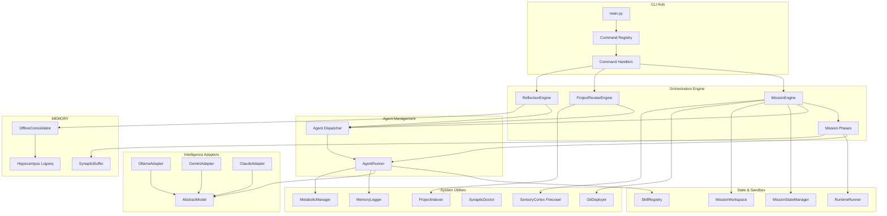
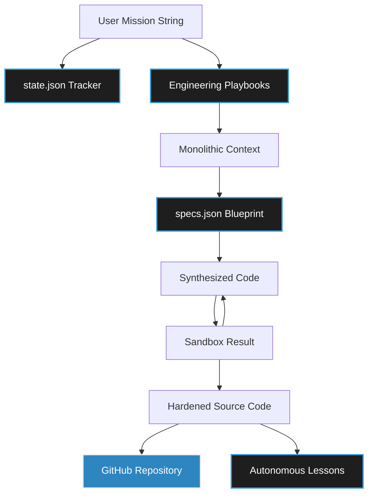
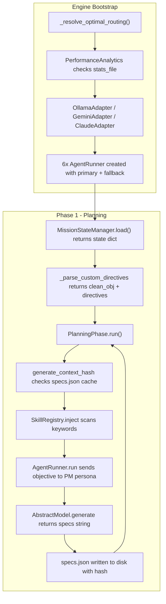
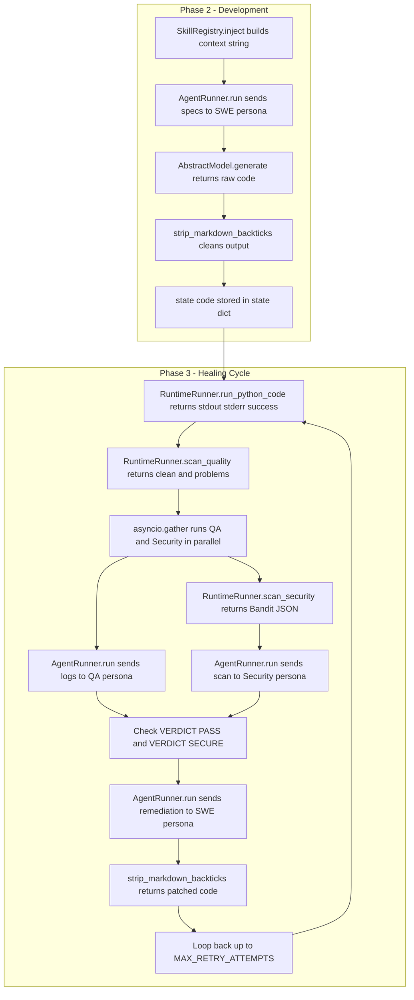
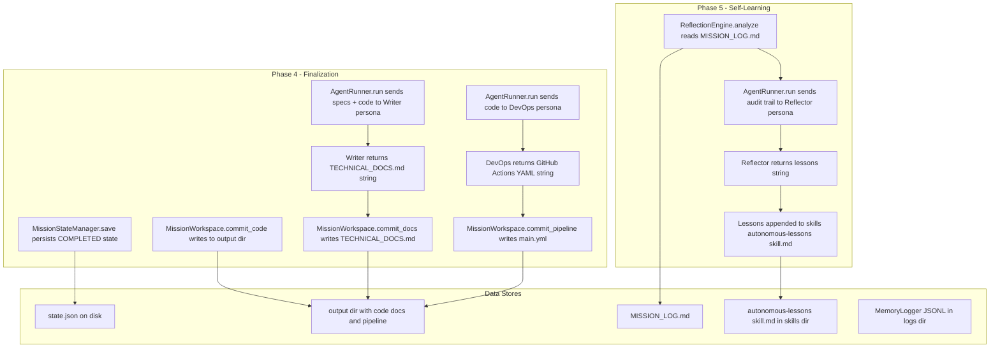
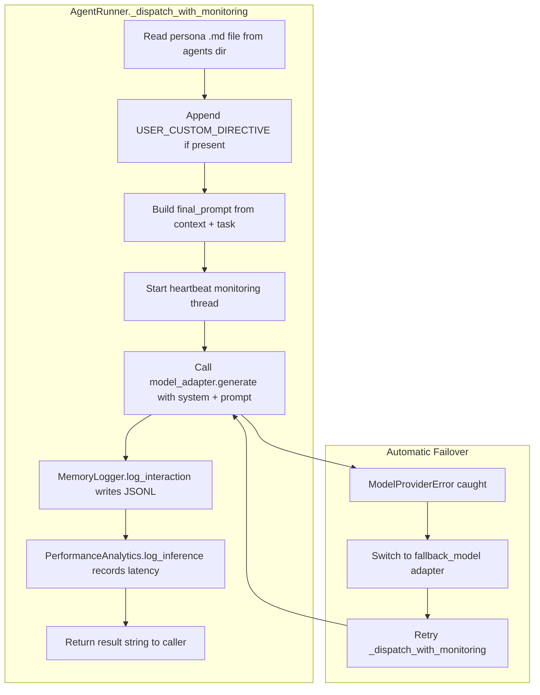

# Synapticity 3.3: The Master Architecture Map

Welcome to the definitive breakdown of the Synapticity framework! We've documented how all the core engines, models, and workflows plug into each other so you can quickly understand exactly how the system pulls off autonomous engineering.

---

## System Component Map



---

## 1. How a Mission Actually Runs (The Daily Workflow)

At its core, Synapticity is driven by a state-machine. It moves through five distinct phases to get things done, and it won't move forward until the code passes some strict verification gates.

### Workflow A: The Standard Mission (launch or resume)

1. **Bootstrap**: First, `main.py` grabs your environment settings from `config.py` and figures out which command you want to run by checking `registry.py`.
2. **Initialization**: Then, the `MissionStateManager` either loads up your existing progress or creates a new `state.json` file. Meanwhile, our `OllamaAdapter` starts waking up local models in the background so there's no waiting around later.
3. **Phase 1 - Planning**:
   - The `MissionEngine` calls in the **Product Manager** agent.
   - Our `SkillRegistry.inject()` function quickly scans your goal for keywords (like "fastapi") and hands the agent the right technical playbooks.
   - We end up with a structurally sound `specs.json` file that acts as our architectural blueprint.
4. **Phase 2 - Development**:
   - The **Software Engineer** agent takes that blueprint and starts writing the actual source code.
   - Once finished, `MissionWorkspace.commit_code()` safely saves it all straight into your mission folder.
5. **Phase 3 - The Healing Cycle (Parallel QA)**:
   - This is the cool part. `RuntimeRunner` executes the new code in a secure sandbox.
   - At the exact same time, the `MissionEngine` asks both the **QA** and **Security Auditor** agents to review the results using `concurrent.futures`.
   - If they catch a bug, the **Software Engineer** gets pinged to apply a fix. This loops until everyone agrees the code is perfect.
6. **Phase 4 - Wrap Up**:
   - The **Technical Writer** drafts up your markdown documentation.
   - The **DevOps Engineer** writes the GitHub Action YAML files for your pipelines.
   - Finally, `GitDeployer` pushes everything up to your remote repository if you asked it to.
7. **Phase 5 - Looking Back**:
   - Right before shutting down, the `ReflectionEngine` reviews the entire mission log to see what it can learn, saving new skills for next time!

---

## 2. The Data Core: How Data Physically Transforms

If you want to know what the framework is actually moving around in memory, here is the exact lifecycle of our data payloads:




### The Code-Level DFD

The following traces the **exact Python variables and method calls** as they flow through the engine during a full mission lifecycle. Split into three stages for clarity.

#### Stage A: Bootstrap and Planning


```

#### Stage B: Development and Healing Cycle



#### Stage C: Finalization and Self-Learning



#### Cross-Cutting: AgentRunner Internal Flow




---

## 3. Core Engines & Libraries (`synaptic/core/`)

Here's the breakdown of the heavy lifters making all the magic happen in the background:

| Component | What it does |
| :--- | :--- |
| `MissionEngine` | The big boss (`mission_engine.py`). It calls `run(mission_id, objective)` to walk through the 5 phases, uses `_resolve_optimal_routing()` to pick the healthiest AI model gracefully, and runs `_finalize()` to wrap up your workspace. |
| `AgentRunner` | The worker bee. Its `run(prompt, context, task)` method talks to the AI, while `_dispatch_with_monitoring()` and `_run_progress_monitor()` keep your CLI updated so you aren't left staring at a blank screen. |
| `PlanningPhase` & `HealingCyclePhase` | Found in `mission_phases.py`, these manage translating goals into specs, or managing that awesome parallel retry-loop when fixing bugs. |
| `ProjectReviewEngine` | The codebase auditor. You can point `review(project_path, ...)` at any local code folder, and it will analyze the files and suggest direct code patches. |
| `SkillRegistry` | Our digital bookshelf. When you run `inject(target_str)`, it matches keywords in your prompt with our best-practice markdown playbooks, automatically teaching the AI what it needs to know. |
| `RuntimeRunner` | The sandbox. It uses `run_python_code(code)` to test things safely and `scan_security(code)` to run Bandit static analysis so nothing dangerous slips out. |
| `ReflectionEngine` | The brains. `analyze(mission_id)` reads through old logs and figures out what the AI should remember for future tasks. |
| `OfflineConsolidator` | The trainer. Executes Unsloth QLoRA fine-tuning and "Dream State" internal simulations to optimize model weights based on failed synapses. |
| `MissionStateManager` | The memory drive. Its `load()` and `save()` methods safely write the `state.json` file so you can always resume right where you left off. |
| `HippocampusController` | The librarian. Interfaces with Logseq/Obsidian Graph API to store Long-Term Potentiation (#Synapticity_LTP) indices. |

---

## 3. The Brains: AI Intelligence (`synaptic/models/`)

| File & Class      | How it thinks                                                                                                                                         |
| :---------------- | :---------------------------------------------------------------------------------------------------------------------------------------------------- |
| `AbstractModel` | The basic contract that says "If you want to be an AI brain here, you must be able to `generate()` text."                                           |
| `OllamaAdapter` | Our**Zero-Latency local driver**. It keeps models infinitely loaded in the background using a `-1 keep_alive` trick so they answer instantly. |
| `GeminiAdapter` | Our**Cloud fallback**. It automatically rotates through API keys to keep you from hitting rate limits.                                          |
| `ClaudeAdapter` | The**Heavy hitter**. When we really need to figure out complex architectural problems, we default to Claude's Sonnet or Opus brains.            |

---

## 4. Helpful Utilities (`synaptic/utils/`)

| Utility            | What it helps with                                                                                                                                                        |
| :----------------- | :------------------------------------------------------------------------------------------------------------------------------------------------------------------------ |
| `SynapticDoctor` | If you run `run_full_service()`, it checks your keys, models, and connections, and even auto-fixes things using `heal()`.                                             |
| `GitDeployer`    | Makes sharing code a breeze.`deploy(path, mission_id)` physically initializes a repo and forces it straight into GitHub.                                                |
| `ProjectIndexer` | The `build_context()` scanner can recursively unpack your entire local application folder into a single readable string so an AI can read your entire codebase at once. |
| `MemoryLogger` | Uses `log_interaction()` to quietly append JSON lines in the background. It remembers everything said during a mission. |
| `SensoryCortex` | The "Eyes". Uses Firecrawl to fetch real-time documentation and bridge the knowledge gap for recently released libraries. |
| `MetabolicManager` | The "Energy Supply". Manages a 5-key pool and performs "Seamless Synaptic Handoffs" during 429 ResourceExhausted errors. |

---

## 5. The Command Hub (`synaptic/cli/`)

| Area            | Purpose                                                                                                                           |
| :-------------- | :-------------------------------------------------------------------------------------------------------------------------------- |
| `registry.py` | This acts as the map tying down exactly what Python function should be called when you type a CLI command.                        |
| `ui.py`       | This makes the CLI look pretty. It renders those awesome live dashboard tables and help menus.                                    |
| `handlers/`   | We keep the actual action scripts (like `handle_launch` or `handle_learn`) separated here so the CLI layer stays lightweight. |

---

## 6. Keeping Things Safe & Fast

We put a lot of work into making sure this framework doesn't just work, but works *well*:

1. **Speed**: We preload the models into VRAM and run QA and Security tests at the exact same time to eliminate wait times.
2. **Safety**: We sandbox the code and run Bandit vulnerability checks so generated scripts don't mess up your computer.
3. **Persistence**: `state.json` means you will never lose progress on a mission, even if your computer crashes.
4. **Resilience**: If your local AI gets overloaded, it effortlessly fails over to Gemini cloud routing so the mission never stops.
