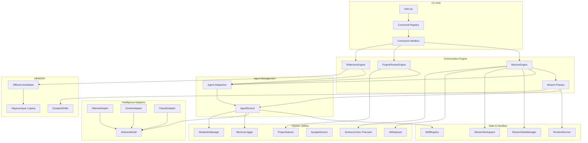
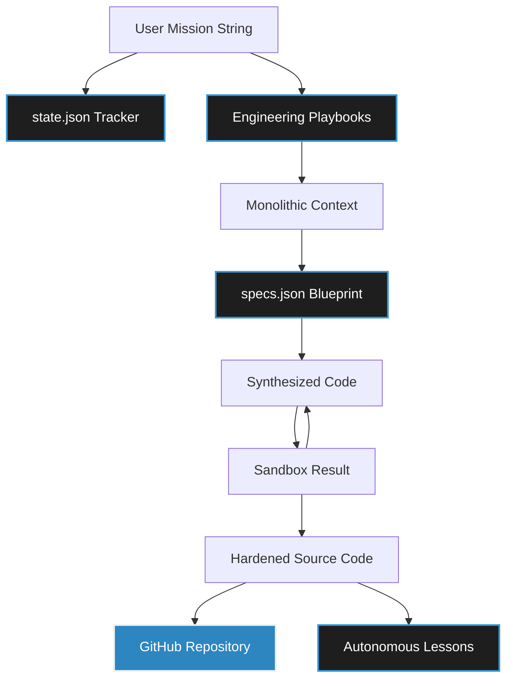
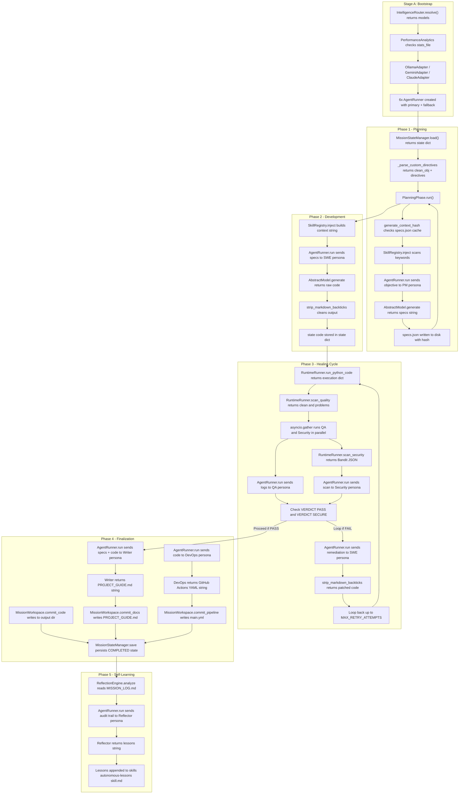
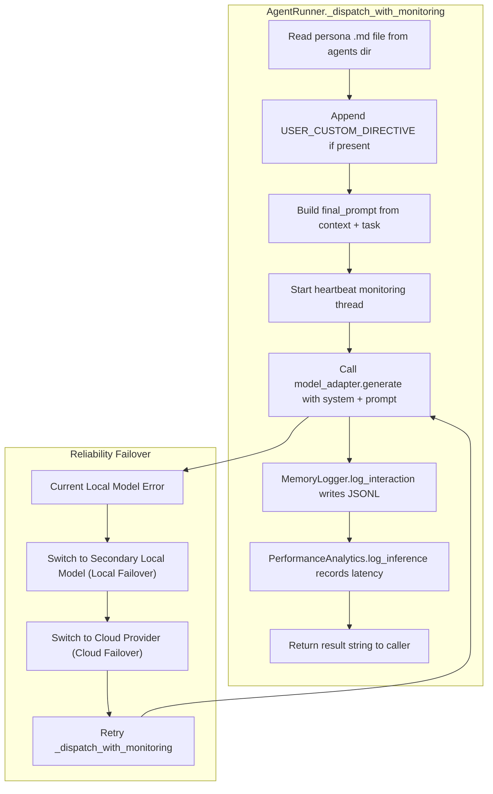

# Synapticity 3.3: Master Architecture Map

This map shows how the different parts of Synapticity work together. You can use it to understand how the system moves from your initial goal to a finished software project.

---

## System Component Map

---

## 1. How a Mission Actually Runs (The Daily Workflow)

At its core, Synapticity is driven by a state-machine. It moves through five distinct phases to get things done, and it won't move forward until the code passes some strict verification gates.

### Workflow A: The Standard Mission (launch or resume)

1. **Bootstrap**: First, `main.py` grabs your environment settings from `config.py` and figures out which command you want to run by checking `registry.py`.
2. **Initialization**: Then, the `MissionStateManager` either loads up your existing progress or creates a new `state.json` file. Meanwhile, our `OllamaAdapter` starts waking up local models in the background so there's no waiting around later.
3. **Phase 1 - Planning**:
   - The `MissionEngine` calls in the **Product Manager** agent.
   - Our `SkillRegistry.inject()` function quickly scans your goal for keywords (like "fastapi") and hands the agent the right technical playbooks.
   - We end up with a structurally sound `specs.json` file that acts as our architectural blueprint.
4. **Phase 2 - Development**:
   - The **Software Engineer** agent takes that blueprint and starts writing the actual source code.
   - Once finished, `MissionWorkspace.commit_code()` safely saves it all straight into your mission folder.
5. **Phase 3 - The Healing Cycle (Parallel QA)**:
   - This is the cool part. `RuntimeRunner` executes the new code in a secure sandbox.
   - At the exact same time, the `MissionEngine` asks both the **QA** and **Security Auditor** agents to review the results using `asyncio.gather`.
   - If they catch a bug, the **Software Engineer** gets pinged to apply a fix. This loops until everyone agrees the code is perfect.
6. **Phase 4 - Wrap Up**:
   - The **Technical Writer** drafts up your markdown documentation.
   - The **DevOps Engineer** writes the GitHub Action YAML files for your pipelines.
   - Finally, `GitDeployer` pushes everything up to your remote repository if you asked it to.
7. **Phase 5 - Looking Back**:
   - Right before shutting down, the `ReflectionEngine` reviews the entire mission log to see what it can learn, saving new skills for next time!

---

## 2. The Data Core: How Data Physically Transforms

If you want to know what the framework is actually moving around in memory, here is the exact lifecycle of our data payloads:

### The Code-Level DFD

#### Master Mission Lifecycle: The Data Journey

The following traces the **exact Python variables and method calls** as they flow through the engine in one continuous, autonomous lifecycle.

#### Cross-Cutting: AgentRunner Internal Flow

---

---

## 3. Core Parts (`synaptic/core/`)

These are the main engines that run the system.

| Part | What it does |
| :--- | :--- |
| `MissionEngine` | Manages the project from start to finish. It uses the `IntelligenceRouter` to pick models and handles the final output. |
| `IntelligenceRouter`| **(NEW)** Selects the best AI model for the job based on your config and project history. |
| `AgentRunner` | Handles the actual calls to the AI and updates the status bar so you can see what's happening. |
| `PlanningPhase` | Plans the project architecture before any code is written. |
| `HealingCyclePhase`| Runs a loop of testing and fixing until the code works perfectly. |
| `ProjectReviewEngine` | Analyzes an existing project folder and suggests ways to improve it. |
| `SkillRegistry` | Matches your goal with technical rules (Skills) and sends them to the AI agents. |
| `RuntimeRunner` | Runs the AI-generated code in a safe sandbox to see if it works. |
| `ReflectionEngine` | Looks at the mission log after it's finished to learn from any mistakes. |
| `OfflineConsolidator` | **(Roadmap)** Fine-tunes local models using data from past missions. |
| `MissionStateManager` | Saves the project progress to `state.json` so you can resume it later. |
| `HippocampusController`| Stores the long-term history of your projects in a graph. |

---

## 4. AI Models (`synaptic/models/`)

Synapticity can use several different AI brains.

| Adapter | Description |
| :--- | :--- |
| `AbstractModel` | The standard set of rules that all AI adapters must follow. |
| `OllamaAdapter` | The local driver. It runs AI models on your own computer for free. |
| `GeminiAdapter` | The cloud driver for Google's Gemini models. It handles key rotation automatically. |
| `ClaudeAdapter` | The cloud driver for Anthropic's Claude models. |

---

## 5. Extra Tools (`synaptic/utils/`)

| Tool | Purpose |
| :--- | :--- |
| `SynapticDoctor` | Checks that your AI keys and connections are working correctly. |
| `GitDeployer` | Automatically creates a GitHub repo and pushes your new code. |
| `ProjectIndexer` | Reads all the files in a folder and packages them for the AI to read. |
| `MemoryLogger` | Logs every message sent to and from the AI agents. |
| `SensoryCortex` | **(Roadmap)** Looks up live documentation on the web to help the AI agents. |
| `MetabolicManager` | **(Roadmap)** Manages a pool of API keys to avoid rate limit errors. |

---

## 5. The Command Hub (`synaptic/cli/`)

| Area            | Purpose                                                                                                                           |
| :-------------- | :-------------------------------------------------------------------------------------------------------------------------------- |
| `registry.py` | This acts as the map tying down exactly what Python function should be called when you type a CLI command.                        |
| `ui.py`       | This makes the CLI look pretty. It renders those awesome live dashboard tables and help menus.                                    |
| `handlers/`   | We keep the actual action scripts (like `handle_launch` or `handle_learn`) separated here so the CLI layer stays lightweight. |

---

## 6. Keeping Things Safe & Fast

The framework is designed to be fast and secure:

1. **Speed**: Processing models in VRAM and running QA and Security tests at the same time eliminates wait times.
2. **Safety**: Code sandboxing and Bandit vulnerability checks help ensure generated scripts are safe.
3. **Persistence**: The `state.json` tracker keeps project progress safe, even if the system stops unexpectedly.
4. **Resilience**: If a local AI becomes overloaded, the system fails over to cloud routing so the mission continues.
